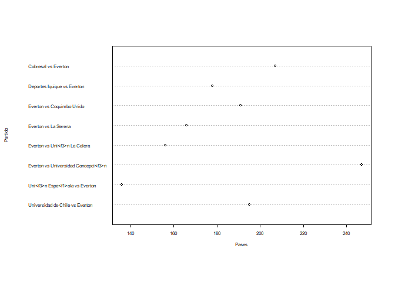
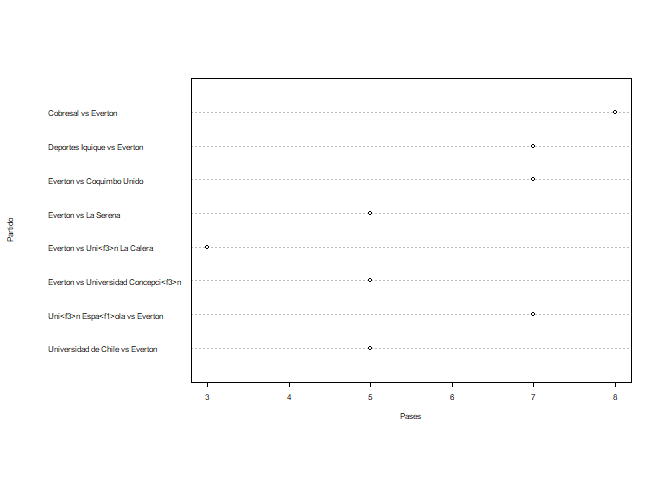

Untitled
================

``` r
library(quanteda)
```

    ## Warning: package 'quanteda' was built under R version 4.0.5

    ## Package version: 2.1.2

    ## Parallel computing: 2 of 8 threads used.

    ## See https://quanteda.io for tutorials and examples.

    ## 
    ## Attaching package: 'quanteda'

    ## The following object is masked from 'package:utils':
    ## 
    ##     View

``` r
library(dplyr)
```

    ## 
    ## Attaching package: 'dplyr'

    ## The following objects are masked from 'package:stats':
    ## 
    ##     filter, lag

    ## The following objects are masked from 'package:base':
    ## 
    ##     intersect, setdiff, setequal, union

``` r
library(tidyverse)
```

    ## -- Attaching packages --------------------------------------- tidyverse 1.3.0 --

    ## v ggplot2 3.3.3     v purrr   0.3.4
    ## v tibble  3.1.0     v stringr 1.4.0
    ## v tidyr   1.1.3     v forcats 0.5.1
    ## v readr   1.4.0

    ## -- Conflicts ------------------------------------------ tidyverse_conflicts() --
    ## x dplyr::filter() masks stats::filter()
    ## x dplyr::lag()    masks stats::lag()

``` r
library(utf8)
library(ggplot2)
```

``` r
setwd("C:/Users/raley/OneDrive/Escritorio/mineria de datos tareas/actividades mineria/ACT2")
data <- read.csv("Primer_Tiempo2020.csv")

head(data)
```

    ##                     torneo               equipo                id_partido
    ## 1 Primera Divisi<f3>n 2020   Uni<f3>n La Calera 6xszsf73jq5za2sb00qx4pox6
    ## 2 Primera Divisi<f3>n 2020 Universidad de Chile 6xszsf73jq5za2sb00qx4pox6
    ## 3 Primera Divisi<f3>n 2020              Everton e88gat05jrffi0pb7zedkbalm
    ## 4 Primera Divisi<f3>n 2020 Universidad de Chile e88gat05jrffi0pb7zedkbalm
    ## 5 Primera Divisi<f3>n 2020      Curic<f3> Unido 35ijq76er8p2f7v0rd4s8s8kq
    ## 6 Primera Divisi<f3>n 2020 Universidad de Chile 35ijq76er8p2f7v0rd4s8s8kq
    ##                                      partido    fasepartido local tiempo
    ## 1 Universidad de Chile vs Uni<f3>n La Calera Regular Season FALSE     fh
    ## 2 Universidad de Chile vs Uni<f3>n La Calera Regular Season  TRUE     fh
    ## 3            Universidad de Chile vs Everton Regular Season FALSE     fh
    ## 4            Universidad de Chile vs Everton Regular Season  TRUE     fh
    ## 5    Universidad de Chile vs Curic<f3> Unido Regular Season FALSE     fh
    ## 6    Universidad de Chile vs Curic<f3> Unido Regular Season  TRUE     fh
    ##   accuratePass wonTackle lostCorners goalsConceded saves ontargetScoringAtt
    ## 1          235         2           3             1     4                  1
    ## 2          199         2           0             0     1                  5
    ## 3          157         7           6             0     3                  2
    ## 4          192         4           1             0     2                  3
    ## 5          142         6           3             2     2                  2
    ## 6          168         8           1             1     2                  4
    ##   totalScoringAtt subsMade totalThrows totalYellowCard goalKicks totalPass
    ## 1               3        0           6               1         3       271
    ## 2               9        0           8               0         2       235
    ## 3               5        0           9               2         2       195
    ## 4               9        0          12               1         3       225
    ## 5               4        0          17               0         6       181
    ## 6               7        0           9               0         4       202
    ##   fkFoulWon totalTackle fkFoulLost possessionPercentage totalClearance
    ## 1         2           3          7                 53.4              6
    ## 2         7           3          2                 46.6              2
    ## 3         6          12          9                 45.7             13
    ## 4         5           6          6                 54.3              4
    ## 5         5           8         11                 47.0              6
    ## 6        10          12          5                 53.0              7
    ##   formationUsed blockedScoringAtt goalAssist goals totalOffside shotOffTarget
    ## 1             0                 1          0     0            0             1
    ## 2             0                 0          1     1            2             4
    ## 3             0                 1          0     0            3             2
    ## 4             0                 4          0     0            0             2
    ## 5             0                 0          1     1            0             2
    ## 6             0                 1          2     2            2             2
    ##   wonCorners cornerTaken penaltyConceded penaltyFaced penGoalsConceded
    ## 1          0           0               0            0                0
    ## 2          3           3               0            0                0
    ## 3          1           1               0            0                0
    ## 4          6           6               0            0                0
    ## 5          1           1               0            0                0
    ## 6          3           3               0            0                0
    ##   penaltyWon ownGoals penaltySave secondYellow totalRedCard posesion_Rival
    ## 1          0        0           0            0            0           46.6
    ## 2          0        0           0            0            0           53.4
    ## 3          0        0           0            0            0           54.3
    ## 4          0        0           0            0            0           45.7
    ## 5          0        0           0            0            0           53.0
    ## 6          0        0           0            0            0           47.0
    ##   precision_pases precision_tiros minutos_juego minutos_juegorival
    ## 1        86.71587        33.33333        24.030             20.970
    ## 2        84.68085        60.00000        20.970             24.030
    ## 3        80.51282        40.00000        20.565             24.435
    ## 4        85.33333        33.33333        24.435             20.565
    ## 5        78.45304        60.00000        21.150             23.850
    ## 6        83.16832        66.66667        23.850             21.150
    ##   golesSalvados foulsInofensivos cortarJuegoContrario juegoCortado
    ## 1             4                6                    9            8
    ## 2             1                2                    4           20
    ## 3             3                7                   16           19
    ## 4             2                5                   10           23
    ## 5             2               11                   17           23
    ## 6             2                5                   13           24

``` r
data <- data[,!(colnames(data) %in% c("id_partido", "fasepartido", "local", "tiempo","formationUsed", "torneo"))]
data
```

    ##                        equipo
    ## 1          Uni<f3>n La Calera
    ## 2        Universidad de Chile
    ## 3                     Everton
    ## 4        Universidad de Chile
    ## 5             Curic<f3> Unido
    ## 6        Universidad de Chile
    ## 7              Coquimbo Unido
    ## 8        Universidad de Chile
    ## 9          Santiago Wanderers
    ## 10  Universidad Concepci<f3>n
    ## 11            Curic<f3> Unido
    ## 12  Universidad Concepci<f3>n
    ## 13                   Cobresal
    ## 14  Universidad Concepci<f3>n
    ## 15                  O'Higgins
    ## 16    Universidad Cat<f3>lica
    ## 17           Deportes Iquique
    ## 18    Universidad Cat<f3>lica
    ## 19    Universidad Cat<f3>lica
    ## 20         Uni<f3>n La Calera
    ## 21       Uni<f3>n Espa<f1>ola
    ## 22         Uni<f3>n La Calera
    ## 23                  La Serena
    ## 24         Uni<f3>n La Calera
    ## 25             Coquimbo Unido
    ## 26         Uni<f3>n La Calera
    ## 27                  Palestino
    ## 28       Uni<f3>n Espa<f1>ola
    ## 29                 Huachipato
    ## 30       Uni<f3>n Espa<f1>ola
    ## 31                    Everton
    ## 32       Uni<f3>n Espa<f1>ola
    ## 33           Deportes Iquique
    ## 34       Uni<f3>n Espa<f1>ola
    ## 35             Audax Italiano
    ## 36       Uni<f3>n Espa<f1>ola
    ## 37       Universidad de Chile
    ## 38         Santiago Wanderers
    ## 39    Universidad Cat<f3>lica
    ## 40         Santiago Wanderers
    ## 41                  Palestino
    ## 42         Santiago Wanderers
    ## 43             Audax Italiano
    ## 44         Santiago Wanderers
    ## 45                  O'Higgins
    ## 46                  Palestino
    ## 47                 Huachipato
    ## 48                  Palestino
    ## 49      Deportivo Antofagasta
    ## 50                  Palestino
    ## 51       Universidad de Chile
    ## 52                  O'Higgins
    ## 53         Uni<f3>n La Calera
    ## 54                  O'Higgins
    ## 55       Uni<f3>n Espa<f1>ola
    ## 56                  O'Higgins
    ## 57         Santiago Wanderers
    ## 58                  O'Higgins
    ## 59         Santiago Wanderers
    ## 60                  La Serena
    ## 61      Deportivo Antofagasta
    ## 62                  La Serena
    ## 63                  Colo Colo
    ## 64                  La Serena
    ## 65                   Cobresal
    ## 66                  La Serena
    ## 67       Universidad de Chile
    ## 68                 Huachipato
    ## 69  Universidad Concepci<f3>n
    ## 70                 Huachipato
    ## 71                   Cobresal
    ## 72                 Huachipato
    ## 73             Audax Italiano
    ## 74                 Huachipato
    ## 75  Universidad Concepci<f3>n
    ## 76                    Everton
    ## 77         Uni<f3>n La Calera
    ## 78                    Everton
    ## 79                  La Serena
    ## 80                    Everton
    ## 81             Coquimbo Unido
    ## 82                    Everton
    ## 83  Universidad Concepci<f3>n
    ## 84      Deportivo Antofagasta
    ## 85    Universidad Cat<f3>lica
    ## 86      Deportivo Antofagasta
    ## 87            Curic<f3> Unido
    ## 88      Deportivo Antofagasta
    ## 89             Coquimbo Unido
    ## 90      Deportivo Antofagasta
    ## 91                  O'Higgins
    ## 92           Deportes Iquique
    ## 93                    Everton
    ## 94           Deportes Iquique
    ## 95      Deportivo Antofagasta
    ## 96           Deportes Iquique
    ## 97                  La Serena
    ## 98            Curic<f3> Unido
    ## 99                 Huachipato
    ## 100           Curic<f3> Unido
    ## 101          Deportes Iquique
    ## 102           Curic<f3> Unido
    ## 103                 Colo Colo
    ## 104           Curic<f3> Unido
    ## 105                 La Serena
    ## 106            Coquimbo Unido
    ## 107          Deportes Iquique
    ## 108            Coquimbo Unido
    ## 109 Universidad Concepci<f3>n
    ## 110                 Colo Colo
    ## 111   Universidad Cat<f3>lica
    ## 112                 Colo Colo
    ## 113                 Palestino
    ## 114                 Colo Colo
    ## 115   Universidad Cat<f3>lica
    ## 116                  Cobresal
    ## 117                   Everton
    ## 118                  Cobresal
    ## 119          Deportes Iquique
    ## 120                  Cobresal
    ## 121                 Colo Colo
    ## 122                  Cobresal
    ## 123 Universidad Concepci<f3>n
    ## 124            Audax Italiano
    ## 125                 Palestino
    ## 126            Audax Italiano
    ## 127                 Colo Colo
    ## 128            Audax Italiano
    ## 129                  Cobresal
    ## 130            Audax Italiano
    ##                                                partido accuratePass wonTackle
    ## 1           Universidad de Chile vs Uni<f3>n La Calera          235         2
    ## 2           Universidad de Chile vs Uni<f3>n La Calera          199         2
    ## 3                      Universidad de Chile vs Everton          157         7
    ## 4                      Universidad de Chile vs Everton          192         4
    ## 5              Universidad de Chile vs Curic<f3> Unido          142         6
    ## 6              Universidad de Chile vs Curic<f3> Unido          168         8
    ## 7               Universidad de Chile vs Coquimbo Unido          190         3
    ## 8               Universidad de Chile vs Coquimbo Unido          200         5
    ## 9      Universidad Concepci<f3>n vs Santiago Wanderers          156         4
    ## 10     Universidad Concepci<f3>n vs Santiago Wanderers           92         4
    ## 11        Universidad Concepci<f3>n vs Curic<f3> Unido          245         5
    ## 12        Universidad Concepci<f3>n vs Curic<f3> Unido           90         5
    ## 13               Universidad Concepci<f3>n vs Cobresal          140         6
    ## 14               Universidad Concepci<f3>n vs Cobresal          161         8
    ## 15                Universidad Cat<f3>lica vs O'Higgins          141         2
    ## 16                Universidad Cat<f3>lica vs O'Higgins          136         4
    ## 17         Universidad Cat<f3>lica vs Deportes Iquique           62         4
    ## 18         Universidad Cat<f3>lica vs Deportes Iquique          269         2
    ## 19       Uni<f3>n La Calera vs Universidad Cat<f3>lica          182         5
    ## 20       Uni<f3>n La Calera vs Universidad Cat<f3>lica          176         6
    ## 21          Uni<f3>n La Calera vs Uni<f3>n Espa<f1>ola          154         3
    ## 22          Uni<f3>n La Calera vs Uni<f3>n Espa<f1>ola          203         4
    ## 23                     Uni<f3>n La Calera vs La Serena          113         7
    ## 24                     Uni<f3>n La Calera vs La Serena          252         6
    ## 25                Uni<f3>n La Calera vs Coquimbo Unido           82         7
    ## 26                Uni<f3>n La Calera vs Coquimbo Unido          237         5
    ## 27                   Uni<f3>n Espa<f1>ola vs Palestino          107         7
    ## 28                   Uni<f3>n Espa<f1>ola vs Palestino          224         7
    ## 29                  Uni<f3>n Espa<f1>ola vs Huachipato           71         4
    ## 30                  Uni<f3>n Espa<f1>ola vs Huachipato          202         2
    ## 31                     Uni<f3>n Espa<f1>ola vs Everton           90         3
    ## 32                     Uni<f3>n Espa<f1>ola vs Everton          196         7
    ## 33            Uni<f3>n Espa<f1>ola vs Deportes Iquique           74         3
    ## 34            Uni<f3>n Espa<f1>ola vs Deportes Iquique          185         3
    ## 35              Uni<f3>n Espa<f1>ola vs Audax Italiano           94         7
    ## 36              Uni<f3>n Espa<f1>ola vs Audax Italiano          158         8
    ## 37          Santiago Wanderers vs Universidad de Chile           92         4
    ## 38          Santiago Wanderers vs Universidad de Chile          135        14
    ## 39       Santiago Wanderers vs Universidad Cat<f3>lica           95         5
    ## 40       Santiago Wanderers vs Universidad Cat<f3>lica          102         2
    ## 41                     Santiago Wanderers vs Palestino          110         4
    ## 42                     Santiago Wanderers vs Palestino           84         8
    ## 43                Santiago Wanderers vs Audax Italiano           91         1
    ## 44                Santiago Wanderers vs Audax Italiano          127         5
    ## 45                              Palestino vs O'Higgins           84         3
    ## 46                              Palestino vs O'Higgins          162         6
    ## 47                             Palestino vs Huachipato          152         4
    ## 48                             Palestino vs Huachipato          132         3
    ## 49                  Palestino vs Deportivo Antofagasta           89         3
    ## 50                  Palestino vs Deportivo Antofagasta          204         4
    ## 51                   O'Higgins vs Universidad de Chile          136         5
    ## 52                   O'Higgins vs Universidad de Chile          114         9
    ## 53                     O'Higgins vs Uni<f3>n La Calera           99         2
    ## 54                     O'Higgins vs Uni<f3>n La Calera          168         6
    ## 55                   O'Higgins vs Uni<f3>n Espa<f1>ola          160         0
    ## 56                   O'Higgins vs Uni<f3>n Espa<f1>ola           82         4
    ## 57                     O'Higgins vs Santiago Wanderers          123         5
    ## 58                     O'Higgins vs Santiago Wanderers           86         2
    ## 59                     La Serena vs Santiago Wanderers          116         6
    ## 60                     La Serena vs Santiago Wanderers          129         1
    ## 61                  La Serena vs Deportivo Antofagasta          148         9
    ## 62                  La Serena vs Deportivo Antofagasta          126         7
    ## 63                              La Serena vs Colo Colo          162         2
    ## 64                              La Serena vs Colo Colo          193         6
    ## 65                               La Serena vs Cobresal          124         7
    ## 66                               La Serena vs Cobresal          147         9
    ## 67                  Huachipato vs Universidad de Chile          202         9
    ## 68                  Huachipato vs Universidad de Chile           97         6
    ## 69             Huachipato vs Universidad Concepci<f3>n           95         2
    ## 70             Huachipato vs Universidad Concepci<f3>n          208         3
    ## 71                              Huachipato vs Cobresal          168         7
    ## 72                              Huachipato vs Cobresal          193         1
    ## 73                        Huachipato vs Audax Italiano          144         4
    ## 74                        Huachipato vs Audax Italiano           89         4
    ## 75                Everton vs Universidad Concepci<f3>n          118        10
    ## 76                Everton vs Universidad Concepci<f3>n          196         4
    ## 77                       Everton vs Uni<f3>n La Calera          193        10
    ## 78                       Everton vs Uni<f3>n La Calera          106         2
    ## 79                                Everton vs La Serena          118         5
    ## 80                                Everton vs La Serena          121         8
    ## 81                           Everton vs Coquimbo Unido          142         8
    ## 82                           Everton vs Coquimbo Unido          144         4
    ## 83  Deportivo Antofagasta vs Universidad Concepci<f3>n           87         6
    ## 84  Deportivo Antofagasta vs Universidad Concepci<f3>n          253        11
    ## 85    Deportivo Antofagasta vs Universidad Cat<f3>lica          202         6
    ## 86    Deportivo Antofagasta vs Universidad Cat<f3>lica          134         4
    ## 87            Deportivo Antofagasta vs Curic<f3> Unido          179         5
    ## 88            Deportivo Antofagasta vs Curic<f3> Unido          175         2
    ## 89             Deportivo Antofagasta vs Coquimbo Unido          143         5
    ## 90             Deportivo Antofagasta vs Coquimbo Unido          162         9
    ## 91                       Deportes Iquique vs O'Higgins          188        10
    ## 92                       Deportes Iquique vs O'Higgins          162         4
    ## 93                         Deportes Iquique vs Everton          122         5
    ## 94                         Deportes Iquique vs Everton          154         4
    ## 95           Deportes Iquique vs Deportivo Antofagasta          124         3
    ## 96           Deportes Iquique vs Deportivo Antofagasta          128         3
    ## 97                        Curic<f3> Unido vs La Serena           66         9
    ## 98                        Curic<f3> Unido vs La Serena          115         6
    ## 99                       Curic<f3> Unido vs Huachipato           84         6
    ## 100                      Curic<f3> Unido vs Huachipato          155         7
    ## 101                Curic<f3> Unido vs Deportes Iquique          136         7
    ## 102                Curic<f3> Unido vs Deportes Iquique          145         7
    ## 103                       Curic<f3> Unido vs Colo Colo          148         5
    ## 104                       Curic<f3> Unido vs Colo Colo          142         7
    ## 105                        Coquimbo Unido vs La Serena          173         7
    ## 106                        Coquimbo Unido vs La Serena          183         4
    ## 107                 Coquimbo Unido vs Deportes Iquique          186         2
    ## 108                 Coquimbo Unido vs Deportes Iquique          141         4
    ## 109             Colo Colo vs Universidad Concepci<f3>n           85         8
    ## 110             Colo Colo vs Universidad Concepci<f3>n          231         4
    ## 111               Colo Colo vs Universidad Cat<f3>lica          138         2
    ## 112               Colo Colo vs Universidad Cat<f3>lica          144         4
    ## 113                             Colo Colo vs Palestino          184         7
    ## 114                             Colo Colo vs Palestino           97         4
    ## 115                Cobresal vs Universidad Cat<f3>lica          177         4
    ## 116                Cobresal vs Universidad Cat<f3>lica          147         7
    ## 117                                Cobresal vs Everton          160        10
    ## 118                                Cobresal vs Everton          179         8
    ## 119                       Cobresal vs Deportes Iquique          193         3
    ## 120                       Cobresal vs Deportes Iquique          217         3
    ## 121                              Cobresal vs Colo Colo          116         6
    ## 122                              Cobresal vs Colo Colo          134         4
    ## 123        Audax Italiano vs Universidad Concepci<f3>n          122         7
    ## 124        Audax Italiano vs Universidad Concepci<f3>n          122         8
    ## 125                        Audax Italiano vs Palestino          151         4
    ## 126                        Audax Italiano vs Palestino          129        11
    ## 127                        Audax Italiano vs Colo Colo          107         2
    ## 128                        Audax Italiano vs Colo Colo          219         6
    ## 129                         Audax Italiano vs Cobresal          141         0
    ## 130                         Audax Italiano vs Cobresal          220         2
    ##     lostCorners goalsConceded saves ontargetScoringAtt totalScoringAtt subsMade
    ## 1             3             1     4                  1               3        0
    ## 2             0             0     1                  5               9        0
    ## 3             6             0     3                  2               5        0
    ## 4             1             0     2                  3               9        0
    ## 5             3             2     2                  2               4        0
    ## 6             1             1     2                  4               7        0
    ## 7             0             0     2                  0               1        0
    ## 8             0             0     0                  2               4        0
    ## 9             3             0     0                  2               7        0
    ## 10            1             1     1                  0               1        1
    ## 11            2             0     2                  2               3        0
    ## 12            2             0     2                  2               8        0
    ## 13            1             0     1                  2               7        0
    ## 14            1             1     1                  1               5        0
    ## 15            3             1     2                  0               2        1
    ## 16            2             0     0                  4               5        0
    ## 17            4             2     1                  2               6        1
    ## 18            3             0     2                  3               8        0
    ## 19            1             1     5                  2               2        0
    ## 20            2             1     1                  5               8        0
    ## 21            0             1     2                  2               8        1
    ## 22            3             0     2                  3               6        0
    ## 23            5             1     1                  4               6        1
    ## 24            3             1     3                  2               7        0
    ## 25            6             1     4                  0               2        1
    ## 26            2             0     0                  5              13        0
    ## 27            4             0     1                  1               4        0
    ## 28            0             1     0                  1               4        1
    ## 29            3             3     2                  2               2        0
    ## 30            0             2     0                  4               5        0
    ## 31            2             0     2                  2               7        0
    ## 32            2             0     2                  2               7        0
    ## 33            2             0     5                  2               3        0
    ## 34            0             1     1                  5              11        0
    ## 35            2             1     1                  3               5        0
    ## 36            1             2     1                  2               7        0
    ## 37            4             1     2                  2               3        0
    ## 38            1             0     2                  3               4        0
    ## 39            1             0     3                  4               5        0
    ## 40            2             1     2                  4              11        0
    ## 41            2             0     0                  3               5        0
    ## 42            2             0     3                  0               3        0
    ## 43            3             2     2                  1               1        0
    ## 44            0             1     0                  4               6        0
    ## 45            0             0     2                  2               7        0
    ## 46            5             0     2                  2               4        0
    ## 47            0             1     2                  1               2        0
    ## 48            3             0     1                  3               6        0
    ## 49            5             0     2                  2               9        0
    ## 50            1             2     1                  2              12        0
    ## 51            1             2     2                  2               3        0
    ## 52            2             1     1                  4               5        0
    ## 53            2             0     1                  2               3        0
    ## 54            3             1     1                  1               7        0
    ## 55            0             1     1                  3               4        0
    ## 56            5             2     1                  2               5        0
    ## 57            1             1     4                  3               8        0
    ## 58            5             1     2                  5               5        0
    ## 59            2             2     1                  3               8        0
    ## 60            0             0     3                  4               7        1
    ## 61            3             0     1                  4               6        0
    ## 62            5             1     3                  1               9        0
    ## 63            3             0     1                  1               4        0
    ## 64            1             0     1                  1               6        0
    ## 65            5             1     3                  2               5        0
    ## 66            2             1     1                  4              14        0
    ## 67            3             0     1                  1               6        0
    ## 68            6             0     1                  1               3        0
    ## 69            1             0     3                  1               6        0
    ## 70            1             1     0                  3               6        0
    ## 71            2             1     1                  2               5        0
    ## 72            2             0     2                  2               3        1
    ## 73            5             2     1                  2               8        0
    ## 74            7             0     2                  3              12        0
    ## 75            3             0     2                  1               5        0
    ## 76            5             1     0                  2               5        0
    ## 77            1             0     2                  2              13        0
    ## 78            6             0     1                  2               3        0
    ## 79            3             0     1                  0               6        0
    ## 80            3             0     0                  1               5        0
    ## 81            4             0     2                  1               5        0
    ## 82            2             0     1                  2               7        0
    ## 83            2             0     0                  2               6        0
    ## 84            1             1     1                  0               5        0
    ## 85            2             1     3                  5               9        0
    ## 86            2             2     3                  4               6        0
    ## 87            4             0     3                  0               0        0
    ## 88            0             0     0                  3               7        0
    ## 89            1             2     3                  0               3        0
    ## 90            1             0     0                  5              14        0
    ## 91            0             1     2                  0              10        0
    ## 92            2             0     0                  3               8        0
    ## 93            0             2     0                  5               7        0
    ## 94            2             0     5                  2               7        1
    ## 95            1             0     3                  4               9        1
    ## 96            2             2     2                  3               4        0
    ## 97            2             1     2                  0               5        1
    ## 98            1             0     0                  3               8        0
    ## 99            2             0     2                  2               4        0
    ## 100           2             0     1                  2               5        0
    ## 101           4             0     3                  0               3        0
    ## 102           4             0     0                  3               9        0
    ## 103           2             0     1                  0               0        0
    ## 104           2             0     0                  1               7        0
    ## 105           4             1     1                  1               6        0
    ## 106           3             0     1                  2               5        0
    ## 107           4             0     2                  1               3        1
    ## 108           2             1     0                  2               6        0
    ## 109           3             2     2                  0               3        0
    ## 110           0             0     0                  4              10        0
    ## 111           4             0     0                  2               5        0
    ## 112           1             0     2                  0               6        0
    ## 113           2             1     0                  1               5        0
    ## 114           2             0     1                  1               3        0
    ## 115           2             0     1                  3              11        0
    ## 116           5             0     3                  1               2        0
    ## 117           2             1     1                  4               8        0
    ## 118           3             1     3                  2               5        0
    ## 119           5             0     2                  1               1        0
    ## 120           1             1     0                  2              11        0
    ## 121           0             0     1                  1               9        0
    ## 122           4             0     1                  1               5        1
    ## 123           4             1     1                  1               6        0
    ## 124           1             0     1                  2               8        0
    ## 125           2             0     2                  2               6        0
    ## 126           1             0     2                  2               6        0
    ## 127           2             2     1                  0               9        0
    ## 128           1             0     0                  3               9        0
    ## 129           1             1     0                  2               6        0
    ## 130           1             1     1                  1               6        0
    ##     totalThrows totalYellowCard goalKicks totalPass fkFoulWon totalTackle
    ## 1             6               1         3       271         2           3
    ## 2             8               0         2       235         7           3
    ## 3             9               2         2       195         6          12
    ## 4            12               1         3       225         5           6
    ## 5            17               0         6       181         5           8
    ## 6             9               0         4       202        10          12
    ## 7            13               1         1       236         5           5
    ## 8            11               0         3       245        10           6
    ## 9            11               0         4       216         7           6
    ## 10           15               1         5       150         7           5
    ## 11            7               1         3       299         4           6
    ## 12           12               1         1       142         4           9
    ## 13           17               2         2       190         5          10
    ## 14            8               0         6       223         6          14
    ## 15           11               1         1       171         4           3
    ## 16            9               0         2       170         6           5
    ## 17            5               2         3        93         7           6
    ## 18            5               0         5       304         7           2
    ## 19            5               2         2       220        10           7
    ## 20            5               2         4       205        10           8
    ## 21           12               2         4       188         5           5
    ## 22            7               1         8       245         5           4
    ## 23            6               1         7       155         4           8
    ## 24           10               0         3       285         6           9
    ## 25            8               1         8       125         2          11
    ## 26           11               0         2       280         7           7
    ## 27            8               2         2       149         5          10
    ## 28           19               0         4       274        10           9
    ## 29           17               2         2       105         5           6
    ## 30           12               1         2       237        10           4
    ## 31            9               1         5       136         5           3
    ## 32           10               1         3       241         4           7
    ## 33            5               2        11       146         5           6
    ## 34           26               1         2       258        10           4
    ## 35            9               0         7       130         5           8
    ## 36           15               1         3       192         5           9
    ## 37           11               0         3       135        10           8
    ## 38            7               2         3       178         5          15
    ## 39           11               2         6       138         6           9
    ## 40           17               0         1       147         6           4
    ## 41           16               0         2       173         8           6
    ## 42           12               1         5       148         7           9
    ## 43           17               3         2       140         9           3
    ## 44           12               1         1       173         5           9
    ## 45            8               0         4       128         7           5
    ## 46           18               1         5       203         8           8
    ## 47           18               2         3       206         9           4
    ## 48           11               2         0       181         7           4
    ## 49           11               0         6       133         6           5
    ## 50           15               0         4       252         3           4
    ## 51           11               1         2       178        12           5
    ## 52           13               2         2       164         7          13
    ## 53           12               0         7       157        10           3
    ## 54           24               2         2       221         4           6
    ## 55           13               2         4       208        10           1
    ## 56            8               2         2       132         4           6
    ## 57            8               1         1       161         7           5
    ## 58           15               1         6       130         7           5
    ## 59           12               0         2       170         6           7
    ## 60           19               1         7       181         5           3
    ## 61            9               2         9       198         8          12
    ## 62           10               1         4       173         4          10
    ## 63           11               1         1       197         5           4
    ## 64            5               1         2       226         8          10
    ## 65            8               2         9       169         6           8
    ## 66           14               0         2       193         9          11
    ## 67           12               0         3       233         6          11
    ## 68           13               1         6       135         4          10
    ## 69           10               1         3       137         8           4
    ## 70            6               1         5       250         6           7
    ## 71            7               1         6       207        10           7
    ## 72            7               2         3       232         7           1
    ## 73            5               1         6       193         5           5
    ## 74            9               1         5       136         4           7
    ## 75            7               1         4       173         3          13
    ## 76           17               1         6       247         6           6
    ## 77            8               0         3       239         4          12
    ## 78           10               0         7       156         4           3
    ## 79            9               1         4       149         8           9
    ## 80            9               0         6       166         6          11
    ## 81           10               1         3       181        10          11
    ## 82           12               1         5       191         6           6
    ## 83            8               0         7       132         5          11
    ## 84            6               1         3       289         4          15
    ## 85            4               0         2       235         8           7
    ## 86            4               1         3       161         8           4
    ## 87           14               0         6       228         9           5
    ## 88            8               2         6       215         8           4
    ## 89            6               1         6       184         4           7
    ## 90            8               0         2       188         9          11
    ## 91           12               2         5       224         2          11
    ## 92           10               0         7       192         9           7
    ## 93           12               2         6       178         5           7
    ## 94            8               1         3       195         7           7
    ## 95           18               2         4       165         7           4
    ## 96           11               1         5       178         4           4
    ## 97           18               0         5       111         5          10
    ## 98           16               1         8       159         7           8
    ## 99           13               2         4       143         4           8
    ## 100          11               0         1       212        10          11
    ## 101          16               0         3       193         7           9
    ## 102          18               0         2       197         5          12
    ## 103          11               2         6       194         7           8
    ## 104          17               0         0       178         8          10
    ## 105          16               0         3       216         8           8
    ## 106           5               1         5       220         3           7
    ## 107          11               1         5       234         8           3
    ## 108           7               1         1       194         2           6
    ## 109           3               1         6       125         5           9
    ## 110          17               0         5       267         6           6
    ## 111           8               1         5       167         6           6
    ## 112           7               1         3       171         7           9
    ## 113          10               1         2       230         7           8
    ## 114          16               0         5       138         7           5
    ## 115           6               1         2       210         8           5
    ## 116          13               2         5       194         7           8
    ## 117           8               0         4       207        10          13
    ## 118          13               1         3       214         5          11
    ## 119           7               0         6       226         7           4
    ## 120           7               1         0       254         3           4
    ## 121          10               0         4       156         8           8
    ## 122          12               2         1       168         5           5
    ## 123          10               1         6       167         6           9
    ## 124          12               1         5       173         9          11
    ## 125          25               0         5       197         5          10
    ## 126          12               0         4       185         4          12
    ## 127           8               0         5       133         4           4
    ## 128          12               2         6       259         6           8
    ## 129          12               2         5       178         5           1
    ## 130           6               1         3       246         6           4
    ##     fkFoulLost possessionPercentage totalClearance blockedScoringAtt goalAssist
    ## 1            7                 53.4              6                 1          0
    ## 2            2                 46.6              2                 0          1
    ## 3            9                 45.7             13                 1          0
    ## 4            6                 54.3              4                 4          0
    ## 5           11                 47.0              6                 0          1
    ## 6            5                 53.0              7                 1          2
    ## 7           10                 49.5              3                 0          0
    ## 8            6                 50.5              4                 1          0
    ## 9            7                 58.4              6                 0          0
    ## 10           7                 41.6              5                 1          0
    ## 11           5                 67.7              5                 1          0
    ## 12           7                 32.3              5                 3          0
    ## 13           6                 46.3              7                 0          0
    ## 14           5                 53.7             12                 1          0
    ## 15           6                 49.5             12                 0          0
    ## 16           4                 50.5              5                 0          0
    ## 17           9                 23.6              5                 2          0
    ## 18           7                 76.4              2                 2          1
    ## 19          11                 52.3              2                 0          1
    ## 20          11                 47.7              4                 1          0
    ## 21           6                 44.4              2                 2          0
    ## 22           6                 55.6             12                 0          0
    ## 23           6                 35.2              7                 1          1
    ## 24           4                 64.8              2                 0          1
    ## 25           8                 31.2              8                 1          0
    ## 26           3                 68.8              3                 4          1
    ## 27          10                 35.0             16                 2          1
    ## 28           6                 65.0              8                 2          0
    ## 29          10                 32.2              6                 0          1
    ## 30           7                 67.8              9                 0          1
    ## 31           5                 36.7              4                 2          0
    ## 32           5                 63.3              4                 1          0
    ## 33          12                 35.5             15                 0          1
    ## 34           5                 64.5              0                 2          0
    ## 35           5                 39.6             13                 1          2
    ## 36           6                 60.4              3                 1          1
    ## 37           6                 42.3              8                 1          0
    ## 38          10                 57.7              8                 0          0
    ## 39           6                 49.3             11                 1          0
    ## 40           8                 50.7              8                 3          0
    ## 41           7                 53.7              4                 0          0
    ## 42           8                 46.3              7                 0          0
    ## 43           6                 43.1             15                 0          0
    ## 44           9                 56.9              3                 1          1
    ## 45           9                 40.2              8                 0          0
    ## 46           7                 59.8              8                 1          0
    ## 47           8                 52.9              7                 1          0
    ## 48          10                 47.1              8                 1          1
    ## 49           6                 34.3             13                 1          1
    ## 50           6                 65.7              8                 6          0
    ## 51           7                 51.8              4                 0          0
    ## 52          13                 48.2              7                 0          2
    ## 53           4                 42.3             14                 0          0
    ## 54          10                 57.7              4                 3          0
    ## 55           5                 61.3              4                 1          1
    ## 56          10                 38.7              6                 0          0
    ## 57           9                 55.9              5                 2          1
    ## 58           8                 44.1              9                 0          0
    ## 59           5                 48.3              6                 1          0
    ## 60           6                 51.7              1                 1          2
    ## 61           7                 53.6              9                 1          1
    ## 62           8                 46.4             11                 1          0
    ## 63           9                 45.8              8                 1          0
    ## 64           5                 54.2              3                 3          0
    ## 65          10                 45.7              6                 2          1
    ## 66           6                 54.3             13                 3          1
    ## 67           4                 63.4              9                 0          0
    ## 68           6                 36.6             10                 0          0
    ## 69           8                 35.2              5                 1          0
    ## 70           9                 64.8              5                 0          0
    ## 71           7                 46.7              4                 0          0
    ## 72          11                 53.3              4                 0          1
    ## 73           4                 58.6             10                 1          0
    ## 74           6                 41.4             11                 5          2
    ## 75           6                 41.8              9                 2          1
    ## 76           3                 58.2             14                 1          0
    ## 77           5                 61.1              7                 6          0
    ## 78           5                 38.9              4                 0          0
    ## 79           7                 47.6             15                 1          0
    ## 80           8                 52.4              8                 2          0
    ## 81           7                 48.6             13                 1          0
    ## 82          10                 51.4             10                 1          0
    ## 83           4                 30.6              8                 0          0
    ## 84           7                 69.4              7                 1          0
    ## 85           8                 58.6              3                 2          2
    ## 86           9                 41.4              8                 0          0
    ## 87          10                 50.8             10                 0          0
    ## 88           9                 49.2              2                 0          0
    ## 89          10                 48.5             16                 3          0
    ## 90           5                 51.5              2                 4          2
    ## 91          10                 54.4              9                 3          0
    ## 92           3                 45.6             10                 0          0
    ## 93           8                 46.9              5                 1          0
    ## 94           5                 53.1             13                 2          1
    ## 95           4                 49.0              9                 1          1
    ## 96           7                 51.0             12                 0          0
    ## 97           8                 41.3              5                 0          0
    ## 98           6                 58.7              7                 2          1
    ## 99          10                 40.3              5                 1          0
    ## 100          4                 59.7              4                 0          0
    ## 101          6                 48.7              9                 1          0
    ## 102          8                 51.3              1                 4          0
    ## 103          9                 52.1             11                 0          0
    ## 104          9                 47.9             11                 1          0
    ## 105          4                 50.2              8                 0          0
    ## 106          8                 49.8             11                 2          0
    ## 107          2                 54.4             13                 2          1
    ## 108          9                 45.6              8                 2          0
    ## 109          6                 31.8             11                 0          0
    ## 110          6                 68.2              4                 2          2
    ## 111          8                 48.1             11                 2          0
    ## 112          6                 51.9              5                 2          0
    ## 113          9                 61.7              5                 1          0
    ## 114          7                 38.3              9                 1          1
    ## 115          7                 52.9              6                 3          0
    ## 116         10                 47.1              8                 1          0
    ## 117          6                 49.8              7                 2          0
    ## 118         10                 50.2             11                 2          1
    ## 119          5                 46.5             16                 0          1
    ## 120          7                 53.5              2                 4          0
    ## 121          5                 49.1              7                 4          0
    ## 122         10                 50.9              7                 1          0
    ## 123         10                 48.6              7                 2          0
    ## 124          7                 51.4             11                 1          1
    ## 125          8                 52.1              2                 1          0
    ## 126          5                 47.9              4                 1          0
    ## 127          7                 34.5              3                 4          0
    ## 128          4                 65.5             10                 2          2
    ## 129          7                 42.0              5                 2          0
    ## 130          6                 58.0             11                 0          1
    ##     goals totalOffside shotOffTarget wonCorners cornerTaken penaltyConceded
    ## 1       0            0             1          0           0               0
    ## 2       1            2             4          3           3               0
    ## 3       0            3             2          1           1               0
    ## 4       0            0             2          6           6               0
    ## 5       1            0             2          1           1               0
    ## 6       2            2             2          3           3               0
    ## 7       0            0             1          0           0               0
    ## 8       0            3             1          0           0               0
    ## 9       1            0             5          1           1               0
    ## 10      0            0             0          3           3               0
    ## 11      0            1             0          2           2               0
    ## 12      0            0             3          2           2               0
    ## 13      1            3             5          1           1               0
    ## 14      0            1             3          1           1               0
    ## 15      0            1             2          2           2               0
    ## 16      1            5             1          3           3               0
    ## 17      0            1             2          3           3               1
    ## 18      2            0             3          4           4               0
    ## 19      1            0             0          2           2               0
    ## 20      1            3             2          1           1               0
    ## 21      0            2             4          3           3               1
    ## 22      1            0             3          0           0               0
    ## 23      1            4             1          3           3               0
    ## 24      1            0             5          5           5               0
    ## 25      0            1             1          2           2               0
    ## 26      1            2             4          6           6               0
    ## 27      1            0             1          0           0               0
    ## 28      0            0             1          4           4               0
    ## 29      2            1             0          0           0               0
    ## 30      3            1             1          3           3               1
    ## 31      0            0             3          2           2               0
    ## 32      0            0             4          2           2               1
    ## 33      1            1             1          0           0               0
    ## 34      0            2             4          2           2               0
    ## 35      2            1             1          1           1               0
    ## 36      1            1             4          2           2               0
    ## 37      0            1             0          1           1               1
    ## 38      1            2             1          4           4               0
    ## 39      1            2             0          2           2               0
    ## 40      0            2             4          1           1               1
    ## 41      0            2             2          2           2               0
    ## 42      0            2             3          2           2               0
    ## 43      1            0             0          0           0               1
    ## 44      2            5             1          3           3               1
    ## 45      0            0             5          5           5               0
    ## 46      0            0             1          0           0               0
    ## 47      0            1             0          3           3               0
    ## 48      1            1             2          0           0               0
    ## 49      2            1             6          1           1               0
    ## 50      0            4             4          5           5               0
    ## 51      1            2             1          2           2               0
    ## 52      2            0             1          1           1               0
    ## 53      1            1             1          3           3               0
    ## 54      0            0             3          2           2               1
    ## 55      2            0             0          5           5               1
    ## 56      1            1             3          0           0               0
    ## 57      1            0             3          5           5               1
    ## 58      1            2             0          1           1               0
    ## 59      0            1             4          0           0               0
    ## 60      2            1             2          2           2               0
    ## 61      1            1             1          5           5               0
    ## 62      0            0             7          3           3               0
    ## 63      0            0             2          1           1               0
    ## 64      0            3             2          3           3               0
    ## 65      1            1             1          2           2               0
    ## 66      1            0             7          5           5               0
    ## 67      0            1             5          6           6               0
    ## 68      0            2             2          3           3               0
    ## 69      1            1             4          1           1               0
    ## 70      0            1             3          1           1               1
    ## 71      0            3             3          2           2               0
    ## 72      1            0             1          2           2               0
    ## 73      0            2             5          7           7               0
    ## 74      2            3             4          5           5               0
    ## 75      1            2             2          5           5               0
    ## 76      0            0             2          3           3               0
    ## 77      0            0             5          6           6               0
    ## 78      0            2             1          1           1               0
    ## 79      0            0             5          3           3               0
    ## 80      0            2             2          3           3               0
    ## 81      0            1             3          2           2               0
    ## 82      0            1             4          4           4               0
    ## 83      1            0             4          1           1               0
    ## 84      0            0             4          2           2               1
    ## 85      2            0             2          2           2               1
    ## 86      1            2             2          2           2               0
    ## 87      0            0             0          0           0               0
    ## 88      0            1             4          4           4               0
    ## 89      0            1             0          1           1               0
    ## 90      2            0             5          1           1               0
    ## 91      0            0             7          2           2               1
    ## 92      1            2             5          0           0               0
    ## 93      0            3             1          2           2               1
    ## 94      2            0             3          0           0               0
    ## 95      2            1             4          2           2               0
    ## 96      0            2             1          1           1               1
    ## 97      0            1             5          1           1               1
    ## 98      1            0             3          2           2               0
    ## 99      0            1             1          2           2               0
    ## 100     0            2             3          2           2               0
    ## 101     0            0             2          4           4               0
    ## 102     0            3             2          4           4               0
    ## 103     0            1             0          2           2               0
    ## 104     0            1             5          2           2               0
    ## 105     0            1             5          3           3               0
    ## 106     1            1             1          4           3               0
    ## 107     1            3             0          2           2               0
    ## 108     0            2             2          4           4               0
    ## 109     0            0             3          0           0               2
    ## 110     2            0             4          3           3               0
    ## 111     0            0             1          1           1               0
    ## 112     0            2             4          4           4               0
    ## 113     0            0             3          2           2               0
    ## 114     1            1             1          2           2               0
    ## 115     0            0             5          5           5               0
    ## 116     0            0             0          2           2               0
    ## 117     1            0             2          3           3               0
    ## 118     1            0             1          2           2               0
    ## 119     1            1             0          1           1               0
    ## 120     0            0             5          5           5               0
    ## 121     0            0             4          4           4               0
    ## 122     0            2             3          0           0               1
    ## 123     0            0             3          1           1               0
    ## 124     1            0             5          4           4               0
    ## 125     0            1             3          1           1               0
    ## 126     0            1             3          2           2               0
    ## 127     0            0             5          1           1               0
    ## 128     2            1             4          2           2               0
    ## 129     1            0             2          1           1               0
    ## 130     1            0             5          1           1               1
    ##     penaltyFaced penGoalsConceded penaltyWon ownGoals penaltySave secondYellow
    ## 1              0                0          0        0           0            0
    ## 2              0                0          0        0           0            0
    ## 3              0                0          0        0           0            0
    ## 4              0                0          0        0           0            0
    ## 5              0                0          0        0           0            0
    ## 6              0                0          0        0           0            0
    ## 7              0                0          0        0           0            0
    ## 8              0                0          0        0           0            0
    ## 9              0                0          0        0           0            0
    ## 10             0                0          0        0           0            0
    ## 11             0                0          0        0           0            0
    ## 12             0                0          0        0           0            0
    ## 13             0                0          0        0           0            0
    ## 14             0                0          0        0           0            0
    ## 15             0                0          0        0           0            0
    ## 16             0                0          0        0           0            0
    ## 17             1                1          0        0           0            1
    ## 18             0                0          1        0           0            0
    ## 19             0                0          0        1           0            0
    ## 20             0                0          0        0           0            0
    ## 21             1                1          0        0           0            0
    ## 22             0                0          1        0           0            0
    ## 23             0                0          0        0           0            0
    ## 24             0                0          0        0           0            0
    ## 25             0                0          0        0           0            0
    ## 26             0                0          0        0           0            0
    ## 27             0                0          0        0           0            0
    ## 28             0                0          0        0           0            1
    ## 29             0                0          1        1           0            0
    ## 30             1                1          0        0           0            0
    ## 31             0                0          1        0           0            0
    ## 32             1                0          0        0           1            0
    ## 33             0                0          0        0           0            0
    ## 34             0                0          0        0           0            0
    ## 35             0                0          0        0           0            0
    ## 36             0                0          0        0           0            0
    ## 37             1                1          0        0           0            0
    ## 38             0                0          1        0           0            0
    ## 39             0                0          1        0           0            0
    ## 40             1                1          0        0           0            0
    ## 41             0                0          0        0           0            0
    ## 42             0                0          0        0           0            0
    ## 43             1                1          1        0           0            0
    ## 44             1                1          1        0           0            0
    ## 45             0                0          0        0           0            0
    ## 46             0                0          0        0           0            0
    ## 47             0                0          0        0           0            0
    ## 48             0                0          0        0           0            0
    ## 49             0                0          0        0           0            0
    ## 50             0                0          0        1           0            0
    ## 51             0                0          0        0           0            0
    ## 52             0                0          0        0           0            0
    ## 53             0                0          1        0           0            0
    ## 54             1                1          0        0           0            0
    ## 55             1                1          0        0           0            0
    ## 56             0                0          1        0           0            0
    ## 57             1                1          0        0           0            0
    ## 58             0                0          1        0           0            0
    ## 59             0                0          0        0           0            0
    ## 60             0                0          0        0           0            0
    ## 61             0                0          0        0           0            0
    ## 62             0                0          0        0           0            0
    ## 63             0                0          0        0           0            0
    ## 64             0                0          0        0           0            0
    ## 65             0                0          0        0           0            0
    ## 66             0                0          0        0           0            0
    ## 67             0                0          0        0           0            0
    ## 68             0                0          0        0           0            0
    ## 69             0                0          1        0           0            0
    ## 70             1                1          0        0           0            0
    ## 71             0                0          0        0           0            0
    ## 72             0                0          0        0           0            0
    ## 73             0                0          0        0           0            0
    ## 74             0                0          0        0           0            0
    ## 75             0                0          0        0           0            0
    ## 76             0                0          0        0           0            0
    ## 77             0                0          0        0           0            0
    ## 78             0                0          0        0           0            0
    ## 79             0                0          0        0           0            0
    ## 80             0                0          0        0           0            0
    ## 81             0                0          0        0           0            0
    ## 82             0                0          0        0           0            0
    ## 83             0                0          1        0           0            0
    ## 84             1                1          0        0           0            0
    ## 85             1                1          0        0           0            0
    ## 86             0                0          1        0           0            0
    ## 87             0                0          0        0           0            0
    ## 88             0                0          0        0           0            0
    ## 89             0                0          0        0           0            0
    ## 90             0                0          0        0           0            0
    ## 91             1                1          0        0           0            0
    ## 92             0                0          1        0           0            0
    ## 93             1                1          0        0           0            0
    ## 94             0                0          1        0           0            0
    ## 95             0                0          1        0           0            0
    ## 96             1                1          0        0           0            0
    ## 97             1                0          0        0           1            0
    ## 98             0                0          1        0           0            0
    ## 99             0                0          0        0           0            0
    ## 100            0                0          0        0           0            0
    ## 101            0                0          0        0           0            0
    ## 102            0                0          0        0           0            0
    ## 103            0                0          0        0           0            0
    ## 104            0                0          0        0           0            0
    ## 105            0                0          0        0           0            0
    ## 106            0                0          0        0           0            0
    ## 107            0                0          0        0           0            0
    ## 108            0                0          0        0           0            0
    ## 109            2                0          0        0           0            0
    ## 110            0                0          2        0           0            0
    ## 111            0                0          0        0           0            0
    ## 112            0                0          0        0           0            0
    ## 113            0                0          0        0           0            0
    ## 114            0                0          0        0           0            0
    ## 115            0                0          0        0           0            0
    ## 116            0                0          0        0           0            0
    ## 117            0                0          0        0           0            0
    ## 118            0                0          0        0           0            0
    ## 119            0                0          0        0           0            0
    ## 120            0                0          0        0           0            0
    ## 121            0                0          1        0           0            0
    ## 122            1                0          0        0           1            0
    ## 123            0                0          0        0           0            0
    ## 124            0                0          0        0           0            0
    ## 125            0                0          0        0           0            0
    ## 126            0                0          0        0           0            0
    ## 127            0                0          0        0           0            0
    ## 128            0                0          0        0           0            0
    ## 129            0                0          1        0           0            0
    ## 130            1                1          0        0           0            0
    ##     totalRedCard posesion_Rival precision_pases precision_tiros minutos_juego
    ## 1              0           46.6        86.71587        33.33333        24.030
    ## 2              0           53.4        84.68085        60.00000        20.970
    ## 3              0           54.3        80.51282        40.00000        20.565
    ## 4              0           45.7        85.33333        33.33333        24.435
    ## 5              0           53.0        78.45304        60.00000        21.150
    ## 6              0           47.0        83.16832        66.66667        23.850
    ## 7              0           50.5        80.50847         0.00000        22.275
    ## 8              0           49.5        81.63265        50.00000        22.725
    ## 9              0           41.6        72.22222        37.50000        26.280
    ## 10             0           58.4        61.33333         0.00000        18.720
    ## 11             0           32.3        81.93980        66.66667        30.465
    ## 12             0           67.7        63.38028        25.00000        14.535
    ## 13             0           53.7        73.68421        37.50000        20.835
    ## 14             0           46.3        72.19731        20.00000        24.165
    ## 15             1           50.5        82.45614         0.00000        22.275
    ## 16             0           49.5        80.00000        83.33333        22.725
    ## 17             1           76.4        66.66667        33.33333        10.620
    ## 18             0           23.6        88.48684        50.00000        34.380
    ## 19             0           47.7        82.72727       100.00000        23.535
    ## 20             0           52.3        85.85366        66.66667        21.465
    ## 21             0           55.6        81.91489        25.00000        19.980
    ## 22             0           44.4        82.85714        57.14286        25.020
    ## 23             0           64.8        72.90323        71.42857        15.840
    ## 24             0           35.2        88.42105        37.50000        29.160
    ## 25             0           68.8        65.60000         0.00000        14.040
    ## 26             0           31.2        84.64286        42.85714        30.960
    ## 27             0           65.0        71.81208        40.00000        15.750
    ## 28             1           35.0        81.75182        25.00000        29.250
    ## 29             0           67.8        67.61905       100.00000        14.490
    ## 30             0           32.2        85.23207        87.50000        30.510
    ## 31             0           63.3        66.17647        28.57143        16.515
    ## 32             0           36.7        81.32780        28.57143        28.485
    ## 33             0           64.5        50.68493        75.00000        15.975
    ## 34             0           35.5        71.70543        45.45455        29.025
    ## 35             0           60.4        72.30769        71.42857        17.820
    ## 36             0           39.6        82.29167        37.50000        27.180
    ## 37             1           57.7        68.14815        66.66667        19.035
    ## 38             0           42.3        75.84270        80.00000        25.965
    ## 39             0           50.7        68.84058        83.33333        22.185
    ## 40             0           49.3        69.38776        36.36364        22.815
    ## 41             0           46.3        63.58382        60.00000        24.165
    ## 42             0           53.7        56.75676         0.00000        20.835
    ## 43             0           56.9        65.00000       100.00000        19.395
    ## 44             0           43.1        73.41040        75.00000        25.605
    ## 45             0           59.8        65.62500        28.57143        18.090
    ## 46             0           40.2        79.80296        50.00000        26.910
    ## 47             0           47.1        73.78641        50.00000        23.805
    ## 48             0           52.9        72.92818        57.14286        21.195
    ## 49             0           65.7        66.91729        36.36364        15.435
    ## 50             0           34.3        80.95238        16.66667        29.565
    ## 51             0           48.2        76.40449        75.00000        23.310
    ## 52             0           51.8        69.51220        85.71429        21.690
    ## 53             0           57.7        63.05732        75.00000        19.035
    ## 54             0           42.3        76.01810        14.28571        25.965
    ## 55             0           38.7        76.92308        83.33333        27.585
    ## 56             0           61.3        62.12121        50.00000        17.415
    ## 57             0           44.1        76.39752        44.44444        25.155
    ## 58             0           55.9        66.15385       100.00000        19.845
    ## 59             0           51.7        68.23529        37.50000        21.735
    ## 60             0           48.3        71.27072        66.66667        23.265
    ## 61             0           46.4        74.74747        71.42857        24.120
    ## 62             0           53.6        72.83237        11.11111        20.880
    ## 63             0           54.2        82.23350        25.00000        20.610
    ## 64             0           45.8        85.39823        16.66667        24.390
    ## 65             0           54.3        73.37278        50.00000        20.565
    ## 66             0           45.7        76.16580        33.33333        24.435
    ## 67             0           36.6        86.69528        16.66667        28.530
    ## 68             0           63.4        71.85185        33.33333        16.470
    ## 69             0           64.8        69.34307        28.57143        15.840
    ## 70             0           35.2        83.20000        50.00000        29.160
    ## 71             0           53.3        81.15942        40.00000        21.015
    ## 72             1           46.7        83.18966        75.00000        23.985
    ## 73             0           41.4        74.61140        25.00000        26.370
    ## 74             0           58.6        65.44118        35.71429        18.630
    ## 75             0           58.2        68.20809        33.33333        18.810
    ## 76             0           41.8        79.35223        40.00000        26.190
    ## 77             0           38.9        80.75314        15.38462        27.495
    ## 78             0           61.1        67.94872        66.66667        17.505
    ## 79             0           52.4        79.19463         0.00000        21.420
    ## 80             0           47.6        72.89157        20.00000        23.580
    ## 81             0           51.4        78.45304        20.00000        21.870
    ## 82             0           48.6        75.39267        28.57143        23.130
    ## 83             0           69.4        65.90909        42.85714        13.770
    ## 84             0           30.6        87.54325         0.00000        31.230
    ## 85             0           41.4        85.95745        63.63636        26.370
    ## 86             0           58.6        83.22981        71.42857        18.630
    ## 87             0           49.2        78.50877         0.00000        22.860
    ## 88             0           50.8        81.39535        42.85714        22.140
    ## 89             0           51.5        77.71739         0.00000        21.825
    ## 90             0           48.5        86.17021        43.75000        23.175
    ## 91             0           45.6        83.92857         0.00000        24.480
    ## 92             0           54.4        84.37500        44.44444        20.520
    ## 93             0           53.1        68.53933        71.42857        21.105
    ## 94             0           46.9        78.97436        44.44444        23.895
    ## 95             0           51.0        75.15152        54.54545        22.050
    ## 96             0           49.0        71.91011        75.00000        22.950
    ## 97             0           58.7        59.45946         0.00000        18.585
    ## 98             0           41.3        72.32704        44.44444        26.415
    ## 99             0           59.7        58.74126        50.00000        18.135
    ## 100            0           40.3        73.11321        40.00000        26.865
    ## 101            0           51.3        70.46632         0.00000        21.915
    ## 102            0           48.7        73.60406        33.33333        23.085
    ## 103            0           47.9        76.28866         0.00000        23.445
    ## 104            0           52.1        79.77528        14.28571        21.555
    ## 105            0           49.8        80.09259        16.66667        22.590
    ## 106            0           50.2        83.18182        50.00000        22.410
    ## 107            0           45.6        79.48718        50.00000        24.480
    ## 108            0           54.4        72.68041        33.33333        20.520
    ## 109            0           68.2        68.00000         0.00000        14.310
    ## 110            0           31.8        86.51685        50.00000        30.690
    ## 111            0           51.9        82.63473        40.00000        21.645
    ## 112            0           48.1        84.21053         0.00000        23.355
    ## 113            0           38.3        80.00000        20.00000        27.765
    ## 114            0           61.7        70.28986        50.00000        17.235
    ## 115            0           47.1        84.28571        27.27273        23.805
    ## 116            0           52.9        75.77320        50.00000        21.195
    ## 117            0           50.2        77.29469        55.55556        22.410
    ## 118            0           49.8        83.64486        50.00000        22.590
    ## 119            0           53.5        85.39823       100.00000        20.925
    ## 120            0           46.5        85.43307        18.18182        24.075
    ## 121            0           50.9        74.35897        11.11111        22.095
    ## 122            0           49.1        79.76190        20.00000        22.905
    ## 123            0           51.4        73.05389        16.66667        21.870
    ## 124            1           48.6        70.52023        33.33333        23.130
    ## 125            0           47.9        76.64975        33.33333        23.445
    ## 126            0           52.1        69.72973        33.33333        21.555
    ## 127            0           65.5        80.45113         0.00000        15.525
    ## 128            0           34.5        84.55598        45.45455        29.475
    ## 129            0           58.0        79.21348        42.85714        18.900
    ## 130            0           42.0        89.43089        28.57143        26.100
    ##     minutos_juegorival golesSalvados foulsInofensivos cortarJuegoContrario
    ## 1               20.970             4                6                    9
    ## 2               24.030             1                2                    4
    ## 3               24.435             3                7                   16
    ## 4               20.565             2                5                   10
    ## 5               23.850             2               11                   17
    ## 6               21.150             2                5                   13
    ## 7               22.725             2                9                   13
    ## 8               22.275             0                6                   11
    ## 9               18.720             0                7                   11
    ## 10              26.280             1                6                   11
    ## 11              14.535             2                4                   10
    ## 12              30.465             2                6                   12
    ## 13              24.165             1                4                   12
    ## 14              20.835             1                5                   13
    ## 15              22.725             2                5                    8
    ## 16              22.275             0                4                    8
    ## 17              34.380             1                7                   13
    ## 18              10.620             2                7                    9
    ## 19              21.465             5                9                   16
    ## 20              23.535             1                9                   17
    ## 21              25.020             2                4                    9
    ## 22              19.980             2                5                   10
    ## 23              29.160             1                5                   13
    ## 24              15.840             3                4                   10
    ## 25              30.960             4                7                   15
    ## 26              14.040             0                3                    8
    ## 27              29.250             1                8                   17
    ## 28              15.750             0                6                   13
    ## 29              30.510             2                8                   14
    ## 30              14.490             0                6                    9
    ## 31              28.485             2                4                    8
    ## 32              16.515             3                4                   12
    ## 33              29.025             5               10                   15
    ## 34              15.975             1                4                    8
    ## 35              27.180             1                5                   12
    ## 36              17.820             1                5                   14
    ## 37              25.965             2                6                   10
    ## 38              19.035             2                8                   24
    ## 39              22.815             3                4                   11
    ## 40              22.185             2                8                   10
    ## 41              20.835             0                7                   11
    ## 42              24.165             3                7                   16
    ## 43              25.605             2                3                    7
    ## 44              19.395             0                8                   14
    ## 45              26.910             2                9                   12
    ## 46              18.090             2                6                   13
    ## 47              21.195             2                6                   12
    ## 48              23.805             1                8                   13
    ## 49              29.565             2                6                    9
    ## 50              15.435             1                6                   10
    ## 51              21.690             2                6                   12
    ## 52              23.310             1               11                   22
    ## 53              25.965             1                4                    6
    ## 54              19.035             1                8                   16
    ## 55              17.415             1                3                    5
    ## 56              27.585             1                8                   14
    ## 57              19.845             4                8                   14
    ## 58              25.155             2                7                   10
    ## 59              23.265             1                5                   11
    ## 60              21.735             3                5                    7
    ## 61              20.880             1                5                   16
    ## 62              24.120             3                7                   15
    ## 63              24.390             1                8                   11
    ## 64              20.610             1                4                   11
    ## 65              24.435             3                8                   17
    ## 66              20.565             1                6                   15
    ## 67              16.470             1                4                   13
    ## 68              28.530             1                5                   12
    ## 69              29.160             3                7                   10
    ## 70              15.840             0                8                   12
    ## 71              23.985             1                6                   14
    ## 72              21.015             2                9                   12
    ## 73              18.630             1                3                    8
    ## 74              26.370             2                5                   10
    ## 75              26.190             2                5                   16
    ## 76              18.810             0                2                    7
    ## 77              17.505             2                5                   15
    ## 78              27.495             1                5                    7
    ## 79              23.580             1                6                   12
    ## 80              21.420             0                8                   16
    ## 81              23.130             2                6                   15
    ## 82              21.870             1                9                   14
    ## 83              31.230             0                4                   10
    ## 84              13.770             1                6                   18
    ## 85              18.630             3                8                   14
    ## 86              26.370             3                8                   13
    ## 87              22.140             3               10                   15
    ## 88              22.860             0                7                   11
    ## 89              23.175             3                9                   15
    ## 90              21.825             0                5                   14
    ## 91              20.520             2                8                   20
    ## 92              24.480             0                3                    7
    ## 93              23.895             0                6                   13
    ## 94              21.105             5                4                    9
    ## 95              22.950             3                2                    7
    ## 96              22.050             2                6                   10
    ## 97              26.415             3                8                   17
    ## 98              18.585             0                5                   12
    ## 99              26.865             2                8                   16
    ## 100             18.135             1                4                   11
    ## 101             23.085             3                6                   13
    ## 102             21.915             0                8                   15
    ## 103             21.555             1                7                   14
    ## 104             23.445             0                9                   16
    ## 105             22.410             1                4                   11
    ## 106             22.590             1                7                   12
    ## 107             20.520             2                1                    4
    ## 108             24.480             0                8                   13
    ## 109             30.690             2                5                   14
    ## 110             14.310             0                6                   10
    ## 111             23.355             0                7                   10
    ## 112             21.645             2                5                   10
    ## 113             17.235             0                8                   16
    ## 114             27.765             1                7                   11
    ## 115             21.195             1                6                   11
    ## 116             23.805             3                8                   17
    ## 117             22.590             1                6                   16
    ## 118             22.410             3                9                   18
    ## 119             24.075             2                5                    8
    ## 120             20.925             0                6                   10
    ## 121             22.905             1                5                   11
    ## 122             22.095             2                8                   14
    ## 123             23.130             1                9                   17
    ## 124             21.870             1                6                   15
    ## 125             21.555             2                8                   12
    ## 126             23.445             2                5                   16
    ## 127             29.475             1                7                    9
    ## 128             15.525             0                2                   10
    ## 129             26.100             0                5                    7
    ## 130             18.900             1                5                    8
    ##     juegoCortado
    ## 1              8
    ## 2             20
    ## 3             19
    ## 4             23
    ## 5             23
    ## 6             24
    ## 7             18
    ## 8             24
    ## 9             19
    ## 10            25
    ## 11            14
    ## 12            18
    ## 13            26
    ## 14            16
    ## 15            18
    ## 16            23
    ## 17            16
    ## 18            16
    ## 19            17
    ## 20            19
    ## 21            22
    ## 22            12
    ## 23            17
    ## 24            21
    ## 25            13
    ## 26            26
    ## 27            13
    ## 28            33
    ## 29            23
    ## 30            26
    ## 31            16
    ## 32            16
    ## 33            11
    ## 34            40
    ## 35            16
    ## 36            23
    ## 37            23
    ## 38            18
    ## 39            21
    ## 40            26
    ## 41            28
    ## 42            23
    ## 43            26
    ## 44            25
    ## 45            20
    ## 46            26
    ## 47            31
    ## 48            19
    ## 49            19
    ## 50            27
    ## 51            27
    ## 52            21
    ## 53            26
    ## 54            30
    ## 55            28
    ## 56            13
    ## 57            20
    ## 58            25
    ## 59            19
    ## 60            27
    ## 61            23
    ## 62            17
    ## 63            17
    ## 64            19
    ## 65            17
    ## 66            28
    ## 67            25
    ## 68            22
    ## 69            20
    ## 70            14
    ## 71            22
    ## 72            16
    ## 73            19
    ## 74            21
    ## 75            17
    ## 76            26
    ## 77            18
    ## 78            17
    ## 79            20
    ## 80            20
    ## 81            23
    ## 82            23
    ## 83            14
    ## 84            12
    ## 85            14
    ## 86            16
    ## 87            23
    ## 88            21
    ## 89            12
    ## 90            18
    ## 91            16
    ## 92            21
    ## 93            22
    ## 94            15
    ## 95            28
    ## 96            18
    ## 97            25
    ## 98            25
    ## 99            20
    ## 100           25
    ## 101           27
    ## 102           30
    ## 103           21
    ## 104           28
    ## 105           28
    ## 106           13
    ## 107           24
    ## 108           15
    ## 109            8
    ## 110           26
    ## 111           15
    ## 112           20
    ## 113           19
    ## 114           26
    ## 115           19
    ## 116           22
    ## 117           21
    ## 118           20
    ## 119           16
    ## 120           15
    ## 121           22
    ## 122           19
    ## 123           17
    ## 124           25
    ## 125           32
    ## 126           19
    ## 127           13
    ## 128           21
    ## 129           18
    ## 130           13

``` r
data1 <- data[order(data$accuratePass, decreasing = TRUE),]
data1
```

    ##                        equipo
    ## 18    Universidad Cat<f3>lica
    ## 84      Deportivo Antofagasta
    ## 24         Uni<f3>n La Calera
    ## 11            Curic<f3> Unido
    ## 26         Uni<f3>n La Calera
    ## 1          Uni<f3>n La Calera
    ## 110                 Colo Colo
    ## 28       Uni<f3>n Espa<f1>ola
    ## 130            Audax Italiano
    ## 128            Audax Italiano
    ## 120                  Cobresal
    ## 70                 Huachipato
    ## 50                  Palestino
    ## 22         Uni<f3>n La Calera
    ## 30       Uni<f3>n Espa<f1>ola
    ## 67       Universidad de Chile
    ## 85    Universidad Cat<f3>lica
    ## 8        Universidad de Chile
    ## 2        Universidad de Chile
    ## 32       Uni<f3>n Espa<f1>ola
    ## 76                    Everton
    ## 64                  La Serena
    ## 72                 Huachipato
    ## 77         Uni<f3>n La Calera
    ## 119          Deportes Iquique
    ## 4        Universidad de Chile
    ## 7              Coquimbo Unido
    ## 91                  O'Higgins
    ## 107          Deportes Iquique
    ## 34       Uni<f3>n Espa<f1>ola
    ## 113                 Palestino
    ## 106            Coquimbo Unido
    ## 19    Universidad Cat<f3>lica
    ## 87            Curic<f3> Unido
    ## 118                  Cobresal
    ## 115   Universidad Cat<f3>lica
    ## 20         Uni<f3>n La Calera
    ## 88      Deportivo Antofagasta
    ## 105                 La Serena
    ## 6        Universidad de Chile
    ## 54                  O'Higgins
    ## 71                   Cobresal
    ## 46                  Palestino
    ## 63                  Colo Colo
    ## 90      Deportivo Antofagasta
    ## 92           Deportes Iquique
    ## 14  Universidad Concepci<f3>n
    ## 55       Uni<f3>n Espa<f1>ola
    ## 117                   Everton
    ## 36       Uni<f3>n Espa<f1>ola
    ## 3                     Everton
    ## 9          Santiago Wanderers
    ## 100           Curic<f3> Unido
    ## 21       Uni<f3>n Espa<f1>ola
    ## 94           Deportes Iquique
    ## 47                 Huachipato
    ## 125                 Palestino
    ## 61      Deportivo Antofagasta
    ## 103                 Colo Colo
    ## 66                  La Serena
    ## 116                  Cobresal
    ## 102           Curic<f3> Unido
    ## 73             Audax Italiano
    ## 82                    Everton
    ## 112                 Colo Colo
    ## 89             Coquimbo Unido
    ## 5             Curic<f3> Unido
    ## 81             Coquimbo Unido
    ## 104           Curic<f3> Unido
    ## 15                  O'Higgins
    ## 108            Coquimbo Unido
    ## 129                  Cobresal
    ## 13                   Cobresal
    ## 111   Universidad Cat<f3>lica
    ## 16    Universidad Cat<f3>lica
    ## 51       Universidad de Chile
    ## 101          Deportes Iquique
    ## 38         Santiago Wanderers
    ## 86      Deportivo Antofagasta
    ## 122                  Cobresal
    ## 48                  Palestino
    ## 60                  La Serena
    ## 126            Audax Italiano
    ## 96           Deportes Iquique
    ## 44         Santiago Wanderers
    ## 62                  La Serena
    ## 65                   Cobresal
    ## 95      Deportivo Antofagasta
    ## 57         Santiago Wanderers
    ## 93                    Everton
    ## 123 Universidad Concepci<f3>n
    ## 124            Audax Italiano
    ## 80                    Everton
    ## 75  Universidad Concepci<f3>n
    ## 79                  La Serena
    ## 59         Santiago Wanderers
    ## 121                 Colo Colo
    ## 98            Curic<f3> Unido
    ## 52                  O'Higgins
    ## 23                  La Serena
    ## 41                  Palestino
    ## 27                  Palestino
    ## 127                 Colo Colo
    ## 78                    Everton
    ## 40         Santiago Wanderers
    ## 53         Uni<f3>n La Calera
    ## 68                 Huachipato
    ## 114                 Colo Colo
    ## 39    Universidad Cat<f3>lica
    ## 69  Universidad Concepci<f3>n
    ## 35             Audax Italiano
    ## 10  Universidad Concepci<f3>n
    ## 37       Universidad de Chile
    ## 43             Audax Italiano
    ## 12  Universidad Concepci<f3>n
    ## 31                    Everton
    ## 49      Deportivo Antofagasta
    ## 74                 Huachipato
    ## 83  Universidad Concepci<f3>n
    ## 58                  O'Higgins
    ## 109 Universidad Concepci<f3>n
    ## 42         Santiago Wanderers
    ## 45                  O'Higgins
    ## 99                 Huachipato
    ## 25             Coquimbo Unido
    ## 56                  O'Higgins
    ## 33           Deportes Iquique
    ## 29                 Huachipato
    ## 97                  La Serena
    ## 17           Deportes Iquique
    ##                                                partido accuratePass wonTackle
    ## 18         Universidad Cat<f3>lica vs Deportes Iquique          269         2
    ## 84  Deportivo Antofagasta vs Universidad Concepci<f3>n          253        11
    ## 24                     Uni<f3>n La Calera vs La Serena          252         6
    ## 11        Universidad Concepci<f3>n vs Curic<f3> Unido          245         5
    ## 26                Uni<f3>n La Calera vs Coquimbo Unido          237         5
    ## 1           Universidad de Chile vs Uni<f3>n La Calera          235         2
    ## 110             Colo Colo vs Universidad Concepci<f3>n          231         4
    ## 28                   Uni<f3>n Espa<f1>ola vs Palestino          224         7
    ## 130                         Audax Italiano vs Cobresal          220         2
    ## 128                        Audax Italiano vs Colo Colo          219         6
    ## 120                       Cobresal vs Deportes Iquique          217         3
    ## 70             Huachipato vs Universidad Concepci<f3>n          208         3
    ## 50                  Palestino vs Deportivo Antofagasta          204         4
    ## 22          Uni<f3>n La Calera vs Uni<f3>n Espa<f1>ola          203         4
    ## 30                  Uni<f3>n Espa<f1>ola vs Huachipato          202         2
    ## 67                  Huachipato vs Universidad de Chile          202         9
    ## 85    Deportivo Antofagasta vs Universidad Cat<f3>lica          202         6
    ## 8               Universidad de Chile vs Coquimbo Unido          200         5
    ## 2           Universidad de Chile vs Uni<f3>n La Calera          199         2
    ## 32                     Uni<f3>n Espa<f1>ola vs Everton          196         7
    ## 76                Everton vs Universidad Concepci<f3>n          196         4
    ## 64                              La Serena vs Colo Colo          193         6
    ## 72                              Huachipato vs Cobresal          193         1
    ## 77                       Everton vs Uni<f3>n La Calera          193        10
    ## 119                       Cobresal vs Deportes Iquique          193         3
    ## 4                      Universidad de Chile vs Everton          192         4
    ## 7               Universidad de Chile vs Coquimbo Unido          190         3
    ## 91                       Deportes Iquique vs O'Higgins          188        10
    ## 107                 Coquimbo Unido vs Deportes Iquique          186         2
    ## 34            Uni<f3>n Espa<f1>ola vs Deportes Iquique          185         3
    ## 113                             Colo Colo vs Palestino          184         7
    ## 106                        Coquimbo Unido vs La Serena          183         4
    ## 19       Uni<f3>n La Calera vs Universidad Cat<f3>lica          182         5
    ## 87            Deportivo Antofagasta vs Curic<f3> Unido          179         5
    ## 118                                Cobresal vs Everton          179         8
    ## 115                Cobresal vs Universidad Cat<f3>lica          177         4
    ## 20       Uni<f3>n La Calera vs Universidad Cat<f3>lica          176         6
    ## 88            Deportivo Antofagasta vs Curic<f3> Unido          175         2
    ## 105                        Coquimbo Unido vs La Serena          173         7
    ## 6              Universidad de Chile vs Curic<f3> Unido          168         8
    ## 54                     O'Higgins vs Uni<f3>n La Calera          168         6
    ## 71                              Huachipato vs Cobresal          168         7
    ## 46                              Palestino vs O'Higgins          162         6
    ## 63                              La Serena vs Colo Colo          162         2
    ## 90             Deportivo Antofagasta vs Coquimbo Unido          162         9
    ## 92                       Deportes Iquique vs O'Higgins          162         4
    ## 14               Universidad Concepci<f3>n vs Cobresal          161         8
    ## 55                   O'Higgins vs Uni<f3>n Espa<f1>ola          160         0
    ## 117                                Cobresal vs Everton          160        10
    ## 36              Uni<f3>n Espa<f1>ola vs Audax Italiano          158         8
    ## 3                      Universidad de Chile vs Everton          157         7
    ## 9      Universidad Concepci<f3>n vs Santiago Wanderers          156         4
    ## 100                      Curic<f3> Unido vs Huachipato          155         7
    ## 21          Uni<f3>n La Calera vs Uni<f3>n Espa<f1>ola          154         3
    ## 94                         Deportes Iquique vs Everton          154         4
    ## 47                             Palestino vs Huachipato          152         4
    ## 125                        Audax Italiano vs Palestino          151         4
    ## 61                  La Serena vs Deportivo Antofagasta          148         9
    ## 103                       Curic<f3> Unido vs Colo Colo          148         5
    ## 66                               La Serena vs Cobresal          147         9
    ## 116                Cobresal vs Universidad Cat<f3>lica          147         7
    ## 102                Curic<f3> Unido vs Deportes Iquique          145         7
    ## 73                        Huachipato vs Audax Italiano          144         4
    ## 82                           Everton vs Coquimbo Unido          144         4
    ## 112               Colo Colo vs Universidad Cat<f3>lica          144         4
    ## 89             Deportivo Antofagasta vs Coquimbo Unido          143         5
    ## 5              Universidad de Chile vs Curic<f3> Unido          142         6
    ## 81                           Everton vs Coquimbo Unido          142         8
    ## 104                       Curic<f3> Unido vs Colo Colo          142         7
    ## 15                Universidad Cat<f3>lica vs O'Higgins          141         2
    ## 108                 Coquimbo Unido vs Deportes Iquique          141         4
    ## 129                         Audax Italiano vs Cobresal          141         0
    ## 13               Universidad Concepci<f3>n vs Cobresal          140         6
    ## 111               Colo Colo vs Universidad Cat<f3>lica          138         2
    ## 16                Universidad Cat<f3>lica vs O'Higgins          136         4
    ## 51                   O'Higgins vs Universidad de Chile          136         5
    ## 101                Curic<f3> Unido vs Deportes Iquique          136         7
    ## 38          Santiago Wanderers vs Universidad de Chile          135        14
    ## 86    Deportivo Antofagasta vs Universidad Cat<f3>lica          134         4
    ## 122                              Cobresal vs Colo Colo          134         4
    ## 48                             Palestino vs Huachipato          132         3
    ## 60                     La Serena vs Santiago Wanderers          129         1
    ## 126                        Audax Italiano vs Palestino          129        11
    ## 96           Deportes Iquique vs Deportivo Antofagasta          128         3
    ## 44                Santiago Wanderers vs Audax Italiano          127         5
    ## 62                  La Serena vs Deportivo Antofagasta          126         7
    ## 65                               La Serena vs Cobresal          124         7
    ## 95           Deportes Iquique vs Deportivo Antofagasta          124         3
    ## 57                     O'Higgins vs Santiago Wanderers          123         5
    ## 93                         Deportes Iquique vs Everton          122         5
    ## 123        Audax Italiano vs Universidad Concepci<f3>n          122         7
    ## 124        Audax Italiano vs Universidad Concepci<f3>n          122         8
    ## 80                                Everton vs La Serena          121         8
    ## 75                Everton vs Universidad Concepci<f3>n          118        10
    ## 79                                Everton vs La Serena          118         5
    ## 59                     La Serena vs Santiago Wanderers          116         6
    ## 121                              Cobresal vs Colo Colo          116         6
    ## 98                        Curic<f3> Unido vs La Serena          115         6
    ## 52                   O'Higgins vs Universidad de Chile          114         9
    ## 23                     Uni<f3>n La Calera vs La Serena          113         7
    ## 41                     Santiago Wanderers vs Palestino          110         4
    ## 27                   Uni<f3>n Espa<f1>ola vs Palestino          107         7
    ## 127                        Audax Italiano vs Colo Colo          107         2
    ## 78                       Everton vs Uni<f3>n La Calera          106         2
    ## 40       Santiago Wanderers vs Universidad Cat<f3>lica          102         2
    ## 53                     O'Higgins vs Uni<f3>n La Calera           99         2
    ## 68                  Huachipato vs Universidad de Chile           97         6
    ## 114                             Colo Colo vs Palestino           97         4
    ## 39       Santiago Wanderers vs Universidad Cat<f3>lica           95         5
    ## 69             Huachipato vs Universidad Concepci<f3>n           95         2
    ## 35              Uni<f3>n Espa<f1>ola vs Audax Italiano           94         7
    ## 10     Universidad Concepci<f3>n vs Santiago Wanderers           92         4
    ## 37          Santiago Wanderers vs Universidad de Chile           92         4
    ## 43                Santiago Wanderers vs Audax Italiano           91         1
    ## 12        Universidad Concepci<f3>n vs Curic<f3> Unido           90         5
    ## 31                     Uni<f3>n Espa<f1>ola vs Everton           90         3
    ## 49                  Palestino vs Deportivo Antofagasta           89         3
    ## 74                        Huachipato vs Audax Italiano           89         4
    ## 83  Deportivo Antofagasta vs Universidad Concepci<f3>n           87         6
    ## 58                     O'Higgins vs Santiago Wanderers           86         2
    ## 109             Colo Colo vs Universidad Concepci<f3>n           85         8
    ## 42                     Santiago Wanderers vs Palestino           84         8
    ## 45                              Palestino vs O'Higgins           84         3
    ## 99                       Curic<f3> Unido vs Huachipato           84         6
    ## 25                Uni<f3>n La Calera vs Coquimbo Unido           82         7
    ## 56                   O'Higgins vs Uni<f3>n Espa<f1>ola           82         4
    ## 33            Uni<f3>n Espa<f1>ola vs Deportes Iquique           74         3
    ## 29                  Uni<f3>n Espa<f1>ola vs Huachipato           71         4
    ## 97                        Curic<f3> Unido vs La Serena           66         9
    ## 17         Universidad Cat<f3>lica vs Deportes Iquique           62         4
    ##     lostCorners goalsConceded saves ontargetScoringAtt totalScoringAtt subsMade
    ## 18            3             0     2                  3               8        0
    ## 84            1             1     1                  0               5        0
    ## 24            3             1     3                  2               7        0
    ## 11            2             0     2                  2               3        0
    ## 26            2             0     0                  5              13        0
    ## 1             3             1     4                  1               3        0
    ## 110           0             0     0                  4              10        0
    ## 28            0             1     0                  1               4        1
    ## 130           1             1     1                  1               6        0
    ## 128           1             0     0                  3               9        0
    ## 120           1             1     0                  2              11        0
    ## 70            1             1     0                  3               6        0
    ## 50            1             2     1                  2              12        0
    ## 22            3             0     2                  3               6        0
    ## 30            0             2     0                  4               5        0
    ## 67            3             0     1                  1               6        0
    ## 85            2             1     3                  5               9        0
    ## 8             0             0     0                  2               4        0
    ## 2             0             0     1                  5               9        0
    ## 32            2             0     2                  2               7        0
    ## 76            5             1     0                  2               5        0
    ## 64            1             0     1                  1               6        0
    ## 72            2             0     2                  2               3        1
    ## 77            1             0     2                  2              13        0
    ## 119           5             0     2                  1               1        0
    ## 4             1             0     2                  3               9        0
    ## 7             0             0     2                  0               1        0
    ## 91            0             1     2                  0              10        0
    ## 107           4             0     2                  1               3        1
    ## 34            0             1     1                  5              11        0
    ## 113           2             1     0                  1               5        0
    ## 106           3             0     1                  2               5        0
    ## 19            1             1     5                  2               2        0
    ## 87            4             0     3                  0               0        0
    ## 118           3             1     3                  2               5        0
    ## 115           2             0     1                  3              11        0
    ## 20            2             1     1                  5               8        0
    ## 88            0             0     0                  3               7        0
    ## 105           4             1     1                  1               6        0
    ## 6             1             1     2                  4               7        0
    ## 54            3             1     1                  1               7        0
    ## 71            2             1     1                  2               5        0
    ## 46            5             0     2                  2               4        0
    ## 63            3             0     1                  1               4        0
    ## 90            1             0     0                  5              14        0
    ## 92            2             0     0                  3               8        0
    ## 14            1             1     1                  1               5        0
    ## 55            0             1     1                  3               4        0
    ## 117           2             1     1                  4               8        0
    ## 36            1             2     1                  2               7        0
    ## 3             6             0     3                  2               5        0
    ## 9             3             0     0                  2               7        0
    ## 100           2             0     1                  2               5        0
    ## 21            0             1     2                  2               8        1
    ## 94            2             0     5                  2               7        1
    ## 47            0             1     2                  1               2        0
    ## 125           2             0     2                  2               6        0
    ## 61            3             0     1                  4               6        0
    ## 103           2             0     1                  0               0        0
    ## 66            2             1     1                  4              14        0
    ## 116           5             0     3                  1               2        0
    ## 102           4             0     0                  3               9        0
    ## 73            5             2     1                  2               8        0
    ## 82            2             0     1                  2               7        0
    ## 112           1             0     2                  0               6        0
    ## 89            1             2     3                  0               3        0
    ## 5             3             2     2                  2               4        0
    ## 81            4             0     2                  1               5        0
    ## 104           2             0     0                  1               7        0
    ## 15            3             1     2                  0               2        1
    ## 108           2             1     0                  2               6        0
    ## 129           1             1     0                  2               6        0
    ## 13            1             0     1                  2               7        0
    ## 111           4             0     0                  2               5        0
    ## 16            2             0     0                  4               5        0
    ## 51            1             2     2                  2               3        0
    ## 101           4             0     3                  0               3        0
    ## 38            1             0     2                  3               4        0
    ## 86            2             2     3                  4               6        0
    ## 122           4             0     1                  1               5        1
    ## 48            3             0     1                  3               6        0
    ## 60            0             0     3                  4               7        1
    ## 126           1             0     2                  2               6        0
    ## 96            2             2     2                  3               4        0
    ## 44            0             1     0                  4               6        0
    ## 62            5             1     3                  1               9        0
    ## 65            5             1     3                  2               5        0
    ## 95            1             0     3                  4               9        1
    ## 57            1             1     4                  3               8        0
    ## 93            0             2     0                  5               7        0
    ## 123           4             1     1                  1               6        0
    ## 124           1             0     1                  2               8        0
    ## 80            3             0     0                  1               5        0
    ## 75            3             0     2                  1               5        0
    ## 79            3             0     1                  0               6        0
    ## 59            2             2     1                  3               8        0
    ## 121           0             0     1                  1               9        0
    ## 98            1             0     0                  3               8        0
    ## 52            2             1     1                  4               5        0
    ## 23            5             1     1                  4               6        1
    ## 41            2             0     0                  3               5        0
    ## 27            4             0     1                  1               4        0
    ## 127           2             2     1                  0               9        0
    ## 78            6             0     1                  2               3        0
    ## 40            2             1     2                  4              11        0
    ## 53            2             0     1                  2               3        0
    ## 68            6             0     1                  1               3        0
    ## 114           2             0     1                  1               3        0
    ## 39            1             0     3                  4               5        0
    ## 69            1             0     3                  1               6        0
    ## 35            2             1     1                  3               5        0
    ## 10            1             1     1                  0               1        1
    ## 37            4             1     2                  2               3        0
    ## 43            3             2     2                  1               1        0
    ## 12            2             0     2                  2               8        0
    ## 31            2             0     2                  2               7        0
    ## 49            5             0     2                  2               9        0
    ## 74            7             0     2                  3              12        0
    ## 83            2             0     0                  2               6        0
    ## 58            5             1     2                  5               5        0
    ## 109           3             2     2                  0               3        0
    ## 42            2             0     3                  0               3        0
    ## 45            0             0     2                  2               7        0
    ## 99            2             0     2                  2               4        0
    ## 25            6             1     4                  0               2        1
    ## 56            5             2     1                  2               5        0
    ## 33            2             0     5                  2               3        0
    ## 29            3             3     2                  2               2        0
    ## 97            2             1     2                  0               5        1
    ## 17            4             2     1                  2               6        1
    ##     totalThrows totalYellowCard goalKicks totalPass fkFoulWon totalTackle
    ## 18            5               0         5       304         7           2
    ## 84            6               1         3       289         4          15
    ## 24           10               0         3       285         6           9
    ## 11            7               1         3       299         4           6
    ## 26           11               0         2       280         7           7
    ## 1             6               1         3       271         2           3
    ## 110          17               0         5       267         6           6
    ## 28           19               0         4       274        10           9
    ## 130           6               1         3       246         6           4
    ## 128          12               2         6       259         6           8
    ## 120           7               1         0       254         3           4
    ## 70            6               1         5       250         6           7
    ## 50           15               0         4       252         3           4
    ## 22            7               1         8       245         5           4
    ## 30           12               1         2       237        10           4
    ## 67           12               0         3       233         6          11
    ## 85            4               0         2       235         8           7
    ## 8            11               0         3       245        10           6
    ## 2             8               0         2       235         7           3
    ## 32           10               1         3       241         4           7
    ## 76           17               1         6       247         6           6
    ## 64            5               1         2       226         8          10
    ## 72            7               2         3       232         7           1
    ## 77            8               0         3       239         4          12
    ## 119           7               0         6       226         7           4
    ## 4            12               1         3       225         5           6
    ## 7            13               1         1       236         5           5
    ## 91           12               2         5       224         2          11
    ## 107          11               1         5       234         8           3
    ## 34           26               1         2       258        10           4
    ## 113          10               1         2       230         7           8
    ## 106           5               1         5       220         3           7
    ## 19            5               2         2       220        10           7
    ## 87           14               0         6       228         9           5
    ## 118          13               1         3       214         5          11
    ## 115           6               1         2       210         8           5
    ## 20            5               2         4       205        10           8
    ## 88            8               2         6       215         8           4
    ## 105          16               0         3       216         8           8
    ## 6             9               0         4       202        10          12
    ## 54           24               2         2       221         4           6
    ## 71            7               1         6       207        10           7
    ## 46           18               1         5       203         8           8
    ## 63           11               1         1       197         5           4
    ## 90            8               0         2       188         9          11
    ## 92           10               0         7       192         9           7
    ## 14            8               0         6       223         6          14
    ## 55           13               2         4       208        10           1
    ## 117           8               0         4       207        10          13
    ## 36           15               1         3       192         5           9
    ## 3             9               2         2       195         6          12
    ## 9            11               0         4       216         7           6
    ## 100          11               0         1       212        10          11
    ## 21           12               2         4       188         5           5
    ## 94            8               1         3       195         7           7
    ## 47           18               2         3       206         9           4
    ## 125          25               0         5       197         5          10
    ## 61            9               2         9       198         8          12
    ## 103          11               2         6       194         7           8
    ## 66           14               0         2       193         9          11
    ## 116          13               2         5       194         7           8
    ## 102          18               0         2       197         5          12
    ## 73            5               1         6       193         5           5
    ## 82           12               1         5       191         6           6
    ## 112           7               1         3       171         7           9
    ## 89            6               1         6       184         4           7
    ## 5            17               0         6       181         5           8
    ## 81           10               1         3       181        10          11
    ## 104          17               0         0       178         8          10
    ## 15           11               1         1       171         4           3
    ## 108           7               1         1       194         2           6
    ## 129          12               2         5       178         5           1
    ## 13           17               2         2       190         5          10
    ## 111           8               1         5       167         6           6
    ## 16            9               0         2       170         6           5
    ## 51           11               1         2       178        12           5
    ## 101          16               0         3       193         7           9
    ## 38            7               2         3       178         5          15
    ## 86            4               1         3       161         8           4
    ## 122          12               2         1       168         5           5
    ## 48           11               2         0       181         7           4
    ## 60           19               1         7       181         5           3
    ## 126          12               0         4       185         4          12
    ## 96           11               1         5       178         4           4
    ## 44           12               1         1       173         5           9
    ## 62           10               1         4       173         4          10
    ## 65            8               2         9       169         6           8
    ## 95           18               2         4       165         7           4
    ## 57            8               1         1       161         7           5
    ## 93           12               2         6       178         5           7
    ## 123          10               1         6       167         6           9
    ## 124          12               1         5       173         9          11
    ## 80            9               0         6       166         6          11
    ## 75            7               1         4       173         3          13
    ## 79            9               1         4       149         8           9
    ## 59           12               0         2       170         6           7
    ## 121          10               0         4       156         8           8
    ## 98           16               1         8       159         7           8
    ## 52           13               2         2       164         7          13
    ## 23            6               1         7       155         4           8
    ## 41           16               0         2       173         8           6
    ## 27            8               2         2       149         5          10
    ## 127           8               0         5       133         4           4
    ## 78           10               0         7       156         4           3
    ## 40           17               0         1       147         6           4
    ## 53           12               0         7       157        10           3
    ## 68           13               1         6       135         4          10
    ## 114          16               0         5       138         7           5
    ## 39           11               2         6       138         6           9
    ## 69           10               1         3       137         8           4
    ## 35            9               0         7       130         5           8
    ## 10           15               1         5       150         7           5
    ## 37           11               0         3       135        10           8
    ## 43           17               3         2       140         9           3
    ## 12           12               1         1       142         4           9
    ## 31            9               1         5       136         5           3
    ## 49           11               0         6       133         6           5
    ## 74            9               1         5       136         4           7
    ## 83            8               0         7       132         5          11
    ## 58           15               1         6       130         7           5
    ## 109           3               1         6       125         5           9
    ## 42           12               1         5       148         7           9
    ## 45            8               0         4       128         7           5
    ## 99           13               2         4       143         4           8
    ## 25            8               1         8       125         2          11
    ## 56            8               2         2       132         4           6
    ## 33            5               2        11       146         5           6
    ## 29           17               2         2       105         5           6
    ## 97           18               0         5       111         5          10
    ## 17            5               2         3        93         7           6
    ##     fkFoulLost possessionPercentage totalClearance blockedScoringAtt goalAssist
    ## 18           7                 76.4              2                 2          1
    ## 84           7                 69.4              7                 1          0
    ## 24           4                 64.8              2                 0          1
    ## 11           5                 67.7              5                 1          0
    ## 26           3                 68.8              3                 4          1
    ## 1            7                 53.4              6                 1          0
    ## 110          6                 68.2              4                 2          2
    ## 28           6                 65.0              8                 2          0
    ## 130          6                 58.0             11                 0          1
    ## 128          4                 65.5             10                 2          2
    ## 120          7                 53.5              2                 4          0
    ## 70           9                 64.8              5                 0          0
    ## 50           6                 65.7              8                 6          0
    ## 22           6                 55.6             12                 0          0
    ## 30           7                 67.8              9                 0          1
    ## 67           4                 63.4              9                 0          0
    ## 85           8                 58.6              3                 2          2
    ## 8            6                 50.5              4                 1          0
    ## 2            2                 46.6              2                 0          1
    ## 32           5                 63.3              4                 1          0
    ## 76           3                 58.2             14                 1          0
    ## 64           5                 54.2              3                 3          0
    ## 72          11                 53.3              4                 0          1
    ## 77           5                 61.1              7                 6          0
    ## 119          5                 46.5             16                 0          1
    ## 4            6                 54.3              4                 4          0
    ## 7           10                 49.5              3                 0          0
    ## 91          10                 54.4              9                 3          0
    ## 107          2                 54.4             13                 2          1
    ## 34           5                 64.5              0                 2          0
    ## 113          9                 61.7              5                 1          0
    ## 106          8                 49.8             11                 2          0
    ## 19          11                 52.3              2                 0          1
    ## 87          10                 50.8             10                 0          0
    ## 118         10                 50.2             11                 2          1
    ## 115          7                 52.9              6                 3          0
    ## 20          11                 47.7              4                 1          0
    ## 88           9                 49.2              2                 0          0
    ## 105          4                 50.2              8                 0          0
    ## 6            5                 53.0              7                 1          2
    ## 54          10                 57.7              4                 3          0
    ## 71           7                 46.7              4                 0          0
    ## 46           7                 59.8              8                 1          0
    ## 63           9                 45.8              8                 1          0
    ## 90           5                 51.5              2                 4          2
    ## 92           3                 45.6             10                 0          0
    ## 14           5                 53.7             12                 1          0
    ## 55           5                 61.3              4                 1          1
    ## 117          6                 49.8              7                 2          0
    ## 36           6                 60.4              3                 1          1
    ## 3            9                 45.7             13                 1          0
    ## 9            7                 58.4              6                 0          0
    ## 100          4                 59.7              4                 0          0
    ## 21           6                 44.4              2                 2          0
    ## 94           5                 53.1             13                 2          1
    ## 47           8                 52.9              7                 1          0
    ## 125          8                 52.1              2                 1          0
    ## 61           7                 53.6              9                 1          1
    ## 103          9                 52.1             11                 0          0
    ## 66           6                 54.3             13                 3          1
    ## 116         10                 47.1              8                 1          0
    ## 102          8                 51.3              1                 4          0
    ## 73           4                 58.6             10                 1          0
    ## 82          10                 51.4             10                 1          0
    ## 112          6                 51.9              5                 2          0
    ## 89          10                 48.5             16                 3          0
    ## 5           11                 47.0              6                 0          1
    ## 81           7                 48.6             13                 1          0
    ## 104          9                 47.9             11                 1          0
    ## 15           6                 49.5             12                 0          0
    ## 108          9                 45.6              8                 2          0
    ## 129          7                 42.0              5                 2          0
    ## 13           6                 46.3              7                 0          0
    ## 111          8                 48.1             11                 2          0
    ## 16           4                 50.5              5                 0          0
    ## 51           7                 51.8              4                 0          0
    ## 101          6                 48.7              9                 1          0
    ## 38          10                 57.7              8                 0          0
    ## 86           9                 41.4              8                 0          0
    ## 122         10                 50.9              7                 1          0
    ## 48          10                 47.1              8                 1          1
    ## 60           6                 51.7              1                 1          2
    ## 126          5                 47.9              4                 1          0
    ## 96           7                 51.0             12                 0          0
    ## 44           9                 56.9              3                 1          1
    ## 62           8                 46.4             11                 1          0
    ## 65          10                 45.7              6                 2          1
    ## 95           4                 49.0              9                 1          1
    ## 57           9                 55.9              5                 2          1
    ## 93           8                 46.9              5                 1          0
    ## 123         10                 48.6              7                 2          0
    ## 124          7                 51.4             11                 1          1
    ## 80           8                 52.4              8                 2          0
    ## 75           6                 41.8              9                 2          1
    ## 79           7                 47.6             15                 1          0
    ## 59           5                 48.3              6                 1          0
    ## 121          5                 49.1              7                 4          0
    ## 98           6                 58.7              7                 2          1
    ## 52          13                 48.2              7                 0          2
    ## 23           6                 35.2              7                 1          1
    ## 41           7                 53.7              4                 0          0
    ## 27          10                 35.0             16                 2          1
    ## 127          7                 34.5              3                 4          0
    ## 78           5                 38.9              4                 0          0
    ## 40           8                 50.7              8                 3          0
    ## 53           4                 42.3             14                 0          0
    ## 68           6                 36.6             10                 0          0
    ## 114          7                 38.3              9                 1          1
    ## 39           6                 49.3             11                 1          0
    ## 69           8                 35.2              5                 1          0
    ## 35           5                 39.6             13                 1          2
    ## 10           7                 41.6              5                 1          0
    ## 37           6                 42.3              8                 1          0
    ## 43           6                 43.1             15                 0          0
    ## 12           7                 32.3              5                 3          0
    ## 31           5                 36.7              4                 2          0
    ## 49           6                 34.3             13                 1          1
    ## 74           6                 41.4             11                 5          2
    ## 83           4                 30.6              8                 0          0
    ## 58           8                 44.1              9                 0          0
    ## 109          6                 31.8             11                 0          0
    ## 42           8                 46.3              7                 0          0
    ## 45           9                 40.2              8                 0          0
    ## 99          10                 40.3              5                 1          0
    ## 25           8                 31.2              8                 1          0
    ## 56          10                 38.7              6                 0          0
    ## 33          12                 35.5             15                 0          1
    ## 29          10                 32.2              6                 0          1
    ## 97           8                 41.3              5                 0          0
    ## 17           9                 23.6              5                 2          0
    ##     goals totalOffside shotOffTarget wonCorners cornerTaken penaltyConceded
    ## 18      2            0             3          4           4               0
    ## 84      0            0             4          2           2               1
    ## 24      1            0             5          5           5               0
    ## 11      0            1             0          2           2               0
    ## 26      1            2             4          6           6               0
    ## 1       0            0             1          0           0               0
    ## 110     2            0             4          3           3               0
    ## 28      0            0             1          4           4               0
    ## 130     1            0             5          1           1               1
    ## 128     2            1             4          2           2               0
    ## 120     0            0             5          5           5               0
    ## 70      0            1             3          1           1               1
    ## 50      0            4             4          5           5               0
    ## 22      1            0             3          0           0               0
    ## 30      3            1             1          3           3               1
    ## 67      0            1             5          6           6               0
    ## 85      2            0             2          2           2               1
    ## 8       0            3             1          0           0               0
    ## 2       1            2             4          3           3               0
    ## 32      0            0             4          2           2               1
    ## 76      0            0             2          3           3               0
    ## 64      0            3             2          3           3               0
    ## 72      1            0             1          2           2               0
    ## 77      0            0             5          6           6               0
    ## 119     1            1             0          1           1               0
    ## 4       0            0             2          6           6               0
    ## 7       0            0             1          0           0               0
    ## 91      0            0             7          2           2               1
    ## 107     1            3             0          2           2               0
    ## 34      0            2             4          2           2               0
    ## 113     0            0             3          2           2               0
    ## 106     1            1             1          4           3               0
    ## 19      1            0             0          2           2               0
    ## 87      0            0             0          0           0               0
    ## 118     1            0             1          2           2               0
    ## 115     0            0             5          5           5               0
    ## 20      1            3             2          1           1               0
    ## 88      0            1             4          4           4               0
    ## 105     0            1             5          3           3               0
    ## 6       2            2             2          3           3               0
    ## 54      0            0             3          2           2               1
    ## 71      0            3             3          2           2               0
    ## 46      0            0             1          0           0               0
    ## 63      0            0             2          1           1               0
    ## 90      2            0             5          1           1               0
    ## 92      1            2             5          0           0               0
    ## 14      0            1             3          1           1               0
    ## 55      2            0             0          5           5               1
    ## 117     1            0             2          3           3               0
    ## 36      1            1             4          2           2               0
    ## 3       0            3             2          1           1               0
    ## 9       1            0             5          1           1               0
    ## 100     0            2             3          2           2               0
    ## 21      0            2             4          3           3               1
    ## 94      2            0             3          0           0               0
    ## 47      0            1             0          3           3               0
    ## 125     0            1             3          1           1               0
    ## 61      1            1             1          5           5               0
    ## 103     0            1             0          2           2               0
    ## 66      1            0             7          5           5               0
    ## 116     0            0             0          2           2               0
    ## 102     0            3             2          4           4               0
    ## 73      0            2             5          7           7               0
    ## 82      0            1             4          4           4               0
    ## 112     0            2             4          4           4               0
    ## 89      0            1             0          1           1               0
    ## 5       1            0             2          1           1               0
    ## 81      0            1             3          2           2               0
    ## 104     0            1             5          2           2               0
    ## 15      0            1             2          2           2               0
    ## 108     0            2             2          4           4               0
    ## 129     1            0             2          1           1               0
    ## 13      1            3             5          1           1               0
    ## 111     0            0             1          1           1               0
    ## 16      1            5             1          3           3               0
    ## 51      1            2             1          2           2               0
    ## 101     0            0             2          4           4               0
    ## 38      1            2             1          4           4               0
    ## 86      1            2             2          2           2               0
    ## 122     0            2             3          0           0               1
    ## 48      1            1             2          0           0               0
    ## 60      2            1             2          2           2               0
    ## 126     0            1             3          2           2               0
    ## 96      0            2             1          1           1               1
    ## 44      2            5             1          3           3               1
    ## 62      0            0             7          3           3               0
    ## 65      1            1             1          2           2               0
    ## 95      2            1             4          2           2               0
    ## 57      1            0             3          5           5               1
    ## 93      0            3             1          2           2               1
    ## 123     0            0             3          1           1               0
    ## 124     1            0             5          4           4               0
    ## 80      0            2             2          3           3               0
    ## 75      1            2             2          5           5               0
    ## 79      0            0             5          3           3               0
    ## 59      0            1             4          0           0               0
    ## 121     0            0             4          4           4               0
    ## 98      1            0             3          2           2               0
    ## 52      2            0             1          1           1               0
    ## 23      1            4             1          3           3               0
    ## 41      0            2             2          2           2               0
    ## 27      1            0             1          0           0               0
    ## 127     0            0             5          1           1               0
    ## 78      0            2             1          1           1               0
    ## 40      0            2             4          1           1               1
    ## 53      1            1             1          3           3               0
    ## 68      0            2             2          3           3               0
    ## 114     1            1             1          2           2               0
    ## 39      1            2             0          2           2               0
    ## 69      1            1             4          1           1               0
    ## 35      2            1             1          1           1               0
    ## 10      0            0             0          3           3               0
    ## 37      0            1             0          1           1               1
    ## 43      1            0             0          0           0               1
    ## 12      0            0             3          2           2               0
    ## 31      0            0             3          2           2               0
    ## 49      2            1             6          1           1               0
    ## 74      2            3             4          5           5               0
    ## 83      1            0             4          1           1               0
    ## 58      1            2             0          1           1               0
    ## 109     0            0             3          0           0               2
    ## 42      0            2             3          2           2               0
    ## 45      0            0             5          5           5               0
    ## 99      0            1             1          2           2               0
    ## 25      0            1             1          2           2               0
    ## 56      1            1             3          0           0               0
    ## 33      1            1             1          0           0               0
    ## 29      2            1             0          0           0               0
    ## 97      0            1             5          1           1               1
    ## 17      0            1             2          3           3               1
    ##     penaltyFaced penGoalsConceded penaltyWon ownGoals penaltySave secondYellow
    ## 18             0                0          1        0           0            0
    ## 84             1                1          0        0           0            0
    ## 24             0                0          0        0           0            0
    ## 11             0                0          0        0           0            0
    ## 26             0                0          0        0           0            0
    ## 1              0                0          0        0           0            0
    ## 110            0                0          2        0           0            0
    ## 28             0                0          0        0           0            1
    ## 130            1                1          0        0           0            0
    ## 128            0                0          0        0           0            0
    ## 120            0                0          0        0           0            0
    ## 70             1                1          0        0           0            0
    ## 50             0                0          0        1           0            0
    ## 22             0                0          1        0           0            0
    ## 30             1                1          0        0           0            0
    ## 67             0                0          0        0           0            0
    ## 85             1                1          0        0           0            0
    ## 8              0                0          0        0           0            0
    ## 2              0                0          0        0           0            0
    ## 32             1                0          0        0           1            0
    ## 76             0                0          0        0           0            0
    ## 64             0                0          0        0           0            0
    ## 72             0                0          0        0           0            0
    ## 77             0                0          0        0           0            0
    ## 119            0                0          0        0           0            0
    ## 4              0                0          0        0           0            0
    ## 7              0                0          0        0           0            0
    ## 91             1                1          0        0           0            0
    ## 107            0                0          0        0           0            0
    ## 34             0                0          0        0           0            0
    ## 113            0                0          0        0           0            0
    ## 106            0                0          0        0           0            0
    ## 19             0                0          0        1           0            0
    ## 87             0                0          0        0           0            0
    ## 118            0                0          0        0           0            0
    ## 115            0                0          0        0           0            0
    ## 20             0                0          0        0           0            0
    ## 88             0                0          0        0           0            0
    ## 105            0                0          0        0           0            0
    ## 6              0                0          0        0           0            0
    ## 54             1                1          0        0           0            0
    ## 71             0                0          0        0           0            0
    ## 46             0                0          0        0           0            0
    ## 63             0                0          0        0           0            0
    ## 90             0                0          0        0           0            0
    ## 92             0                0          1        0           0            0
    ## 14             0                0          0        0           0            0
    ## 55             1                1          0        0           0            0
    ## 117            0                0          0        0           0            0
    ## 36             0                0          0        0           0            0
    ## 3              0                0          0        0           0            0
    ## 9              0                0          0        0           0            0
    ## 100            0                0          0        0           0            0
    ## 21             1                1          0        0           0            0
    ## 94             0                0          1        0           0            0
    ## 47             0                0          0        0           0            0
    ## 125            0                0          0        0           0            0
    ## 61             0                0          0        0           0            0
    ## 103            0                0          0        0           0            0
    ## 66             0                0          0        0           0            0
    ## 116            0                0          0        0           0            0
    ## 102            0                0          0        0           0            0
    ## 73             0                0          0        0           0            0
    ## 82             0                0          0        0           0            0
    ## 112            0                0          0        0           0            0
    ## 89             0                0          0        0           0            0
    ## 5              0                0          0        0           0            0
    ## 81             0                0          0        0           0            0
    ## 104            0                0          0        0           0            0
    ## 15             0                0          0        0           0            0
    ## 108            0                0          0        0           0            0
    ## 129            0                0          1        0           0            0
    ## 13             0                0          0        0           0            0
    ## 111            0                0          0        0           0            0
    ## 16             0                0          0        0           0            0
    ## 51             0                0          0        0           0            0
    ## 101            0                0          0        0           0            0
    ## 38             0                0          1        0           0            0
    ## 86             0                0          1        0           0            0
    ## 122            1                0          0        0           1            0
    ## 48             0                0          0        0           0            0
    ## 60             0                0          0        0           0            0
    ## 126            0                0          0        0           0            0
    ## 96             1                1          0        0           0            0
    ## 44             1                1          1        0           0            0
    ## 62             0                0          0        0           0            0
    ## 65             0                0          0        0           0            0
    ## 95             0                0          1        0           0            0
    ## 57             1                1          0        0           0            0
    ## 93             1                1          0        0           0            0
    ## 123            0                0          0        0           0            0
    ## 124            0                0          0        0           0            0
    ## 80             0                0          0        0           0            0
    ## 75             0                0          0        0           0            0
    ## 79             0                0          0        0           0            0
    ## 59             0                0          0        0           0            0
    ## 121            0                0          1        0           0            0
    ## 98             0                0          1        0           0            0
    ## 52             0                0          0        0           0            0
    ## 23             0                0          0        0           0            0
    ## 41             0                0          0        0           0            0
    ## 27             0                0          0        0           0            0
    ## 127            0                0          0        0           0            0
    ## 78             0                0          0        0           0            0
    ## 40             1                1          0        0           0            0
    ## 53             0                0          1        0           0            0
    ## 68             0                0          0        0           0            0
    ## 114            0                0          0        0           0            0
    ## 39             0                0          1        0           0            0
    ## 69             0                0          1        0           0            0
    ## 35             0                0          0        0           0            0
    ## 10             0                0          0        0           0            0
    ## 37             1                1          0        0           0            0
    ## 43             1                1          1        0           0            0
    ## 12             0                0          0        0           0            0
    ## 31             0                0          1        0           0            0
    ## 49             0                0          0        0           0            0
    ## 74             0                0          0        0           0            0
    ## 83             0                0          1        0           0            0
    ## 58             0                0          1        0           0            0
    ## 109            2                0          0        0           0            0
    ## 42             0                0          0        0           0            0
    ## 45             0                0          0        0           0            0
    ## 99             0                0          0        0           0            0
    ## 25             0                0          0        0           0            0
    ## 56             0                0          1        0           0            0
    ## 33             0                0          0        0           0            0
    ## 29             0                0          1        1           0            0
    ## 97             1                0          0        0           1            0
    ## 17             1                1          0        0           0            1
    ##     totalRedCard posesion_Rival precision_pases precision_tiros minutos_juego
    ## 18             0           23.6        88.48684        50.00000        34.380
    ## 84             0           30.6        87.54325         0.00000        31.230
    ## 24             0           35.2        88.42105        37.50000        29.160
    ## 11             0           32.3        81.93980        66.66667        30.465
    ## 26             0           31.2        84.64286        42.85714        30.960
    ## 1              0           46.6        86.71587        33.33333        24.030
    ## 110            0           31.8        86.51685        50.00000        30.690
    ## 28             1           35.0        81.75182        25.00000        29.250
    ## 130            0           42.0        89.43089        28.57143        26.100
    ## 128            0           34.5        84.55598        45.45455        29.475
    ## 120            0           46.5        85.43307        18.18182        24.075
    ## 70             0           35.2        83.20000        50.00000        29.160
    ## 50             0           34.3        80.95238        16.66667        29.565
    ## 22             0           44.4        82.85714        57.14286        25.020
    ## 30             0           32.2        85.23207        87.50000        30.510
    ## 67             0           36.6        86.69528        16.66667        28.530
    ## 85             0           41.4        85.95745        63.63636        26.370
    ## 8              0           49.5        81.63265        50.00000        22.725
    ## 2              0           53.4        84.68085        60.00000        20.970
    ## 32             0           36.7        81.32780        28.57143        28.485
    ## 76             0           41.8        79.35223        40.00000        26.190
    ## 64             0           45.8        85.39823        16.66667        24.390
    ## 72             1           46.7        83.18966        75.00000        23.985
    ## 77             0           38.9        80.75314        15.38462        27.495
    ## 119            0           53.5        85.39823       100.00000        20.925
    ## 4              0           45.7        85.33333        33.33333        24.435
    ## 7              0           50.5        80.50847         0.00000        22.275
    ## 91             0           45.6        83.92857         0.00000        24.480
    ## 107            0           45.6        79.48718        50.00000        24.480
    ## 34             0           35.5        71.70543        45.45455        29.025
    ## 113            0           38.3        80.00000        20.00000        27.765
    ## 106            0           50.2        83.18182        50.00000        22.410
    ## 19             0           47.7        82.72727       100.00000        23.535
    ## 87             0           49.2        78.50877         0.00000        22.860
    ## 118            0           49.8        83.64486        50.00000        22.590
    ## 115            0           47.1        84.28571        27.27273        23.805
    ## 20             0           52.3        85.85366        66.66667        21.465
    ## 88             0           50.8        81.39535        42.85714        22.140
    ## 105            0           49.8        80.09259        16.66667        22.590
    ## 6              0           47.0        83.16832        66.66667        23.850
    ## 54             0           42.3        76.01810        14.28571        25.965
    ## 71             0           53.3        81.15942        40.00000        21.015
    ## 46             0           40.2        79.80296        50.00000        26.910
    ## 63             0           54.2        82.23350        25.00000        20.610
    ## 90             0           48.5        86.17021        43.75000        23.175
    ## 92             0           54.4        84.37500        44.44444        20.520
    ## 14             0           46.3        72.19731        20.00000        24.165
    ## 55             0           38.7        76.92308        83.33333        27.585
    ## 117            0           50.2        77.29469        55.55556        22.410
    ## 36             0           39.6        82.29167        37.50000        27.180
    ## 3              0           54.3        80.51282        40.00000        20.565
    ## 9              0           41.6        72.22222        37.50000        26.280
    ## 100            0           40.3        73.11321        40.00000        26.865
    ## 21             0           55.6        81.91489        25.00000        19.980
    ## 94             0           46.9        78.97436        44.44444        23.895
    ## 47             0           47.1        73.78641        50.00000        23.805
    ## 125            0           47.9        76.64975        33.33333        23.445
    ## 61             0           46.4        74.74747        71.42857        24.120
    ## 103            0           47.9        76.28866         0.00000        23.445
    ## 66             0           45.7        76.16580        33.33333        24.435
    ## 116            0           52.9        75.77320        50.00000        21.195
    ## 102            0           48.7        73.60406        33.33333        23.085
    ## 73             0           41.4        74.61140        25.00000        26.370
    ## 82             0           48.6        75.39267        28.57143        23.130
    ## 112            0           48.1        84.21053         0.00000        23.355
    ## 89             0           51.5        77.71739         0.00000        21.825
    ## 5              0           53.0        78.45304        60.00000        21.150
    ## 81             0           51.4        78.45304        20.00000        21.870
    ## 104            0           52.1        79.77528        14.28571        21.555
    ## 15             1           50.5        82.45614         0.00000        22.275
    ## 108            0           54.4        72.68041        33.33333        20.520
    ## 129            0           58.0        79.21348        42.85714        18.900
    ## 13             0           53.7        73.68421        37.50000        20.835
    ## 111            0           51.9        82.63473        40.00000        21.645
    ## 16             0           49.5        80.00000        83.33333        22.725
    ## 51             0           48.2        76.40449        75.00000        23.310
    ## 101            0           51.3        70.46632         0.00000        21.915
    ## 38             0           42.3        75.84270        80.00000        25.965
    ## 86             0           58.6        83.22981        71.42857        18.630
    ## 122            0           49.1        79.76190        20.00000        22.905
    ## 48             0           52.9        72.92818        57.14286        21.195
    ## 60             0           48.3        71.27072        66.66667        23.265
    ## 126            0           52.1        69.72973        33.33333        21.555
    ## 96             0           49.0        71.91011        75.00000        22.950
    ## 44             0           43.1        73.41040        75.00000        25.605
    ## 62             0           53.6        72.83237        11.11111        20.880
    ## 65             0           54.3        73.37278        50.00000        20.565
    ## 95             0           51.0        75.15152        54.54545        22.050
    ## 57             0           44.1        76.39752        44.44444        25.155
    ## 93             0           53.1        68.53933        71.42857        21.105
    ## 123            0           51.4        73.05389        16.66667        21.870
    ## 124            1           48.6        70.52023        33.33333        23.130
    ## 80             0           47.6        72.89157        20.00000        23.580
    ## 75             0           58.2        68.20809        33.33333        18.810
    ## 79             0           52.4        79.19463         0.00000        21.420
    ## 59             0           51.7        68.23529        37.50000        21.735
    ## 121            0           50.9        74.35897        11.11111        22.095
    ## 98             0           41.3        72.32704        44.44444        26.415
    ## 52             0           51.8        69.51220        85.71429        21.690
    ## 23             0           64.8        72.90323        71.42857        15.840
    ## 41             0           46.3        63.58382        60.00000        24.165
    ## 27             0           65.0        71.81208        40.00000        15.750
    ## 127            0           65.5        80.45113         0.00000        15.525
    ## 78             0           61.1        67.94872        66.66667        17.505
    ## 40             0           49.3        69.38776        36.36364        22.815
    ## 53             0           57.7        63.05732        75.00000        19.035
    ## 68             0           63.4        71.85185        33.33333        16.470
    ## 114            0           61.7        70.28986        50.00000        17.235
    ## 39             0           50.7        68.84058        83.33333        22.185
    ## 69             0           64.8        69.34307        28.57143        15.840
    ## 35             0           60.4        72.30769        71.42857        17.820
    ## 10             0           58.4        61.33333         0.00000        18.720
    ## 37             1           57.7        68.14815        66.66667        19.035
    ## 43             0           56.9        65.00000       100.00000        19.395
    ## 12             0           67.7        63.38028        25.00000        14.535
    ## 31             0           63.3        66.17647        28.57143        16.515
    ## 49             0           65.7        66.91729        36.36364        15.435
    ## 74             0           58.6        65.44118        35.71429        18.630
    ## 83             0           69.4        65.90909        42.85714        13.770
    ## 58             0           55.9        66.15385       100.00000        19.845
    ## 109            0           68.2        68.00000         0.00000        14.310
    ## 42             0           53.7        56.75676         0.00000        20.835
    ## 45             0           59.8        65.62500        28.57143        18.090
    ## 99             0           59.7        58.74126        50.00000        18.135
    ## 25             0           68.8        65.60000         0.00000        14.040
    ## 56             0           61.3        62.12121        50.00000        17.415
    ## 33             0           64.5        50.68493        75.00000        15.975
    ## 29             0           67.8        67.61905       100.00000        14.490
    ## 97             0           58.7        59.45946         0.00000        18.585
    ## 17             1           76.4        66.66667        33.33333        10.620
    ##     minutos_juegorival golesSalvados foulsInofensivos cortarJuegoContrario
    ## 18              10.620             2                7                    9
    ## 84              13.770             1                6                   18
    ## 24              15.840             3                4                   10
    ## 11              14.535             2                4                   10
    ## 26              14.040             0                3                    8
    ## 1               20.970             4                6                    9
    ## 110             14.310             0                6                   10
    ## 28              15.750             0                6                   13
    ## 130             18.900             1                5                    8
    ## 128             15.525             0                2                   10
    ## 120             20.925             0                6                   10
    ## 70              15.840             0                8                   12
    ## 50              15.435             1                6                   10
    ## 22              19.980             2                5                   10
    ## 30              14.490             0                6                    9
    ## 67              16.470             1                4                   13
    ## 85              18.630             3                8                   14
    ## 8               22.275             0                6                   11
    ## 2               24.030             1                2                    4
    ## 32              16.515             3                4                   12
    ## 76              18.810             0                2                    7
    ## 64              20.610             1                4                   11
    ## 72              21.015             2                9                   12
    ## 77              17.505             2                5                   15
    ## 119             24.075             2                5                    8
    ## 4               20.565             2                5                   10
    ## 7               22.725             2                9                   13
    ## 91              20.520             2                8                   20
    ## 107             20.520             2                1                    4
    ## 34              15.975             1                4                    8
    ## 113             17.235             0                8                   16
    ## 106             22.590             1                7                   12
    ## 19              21.465             5                9                   16
    ## 87              22.140             3               10                   15
    ## 118             22.410             3                9                   18
    ## 115             21.195             1                6                   11
    ## 20              23.535             1                9                   17
    ## 88              22.860             0                7                   11
    ## 105             22.410             1                4                   11
    ## 6               21.150             2                5                   13
    ## 54              19.035             1                8                   16
    ## 71              23.985             1                6                   14
    ## 46              18.090             2                6                   13
    ## 63              24.390             1                8                   11
    ## 90              21.825             0                5                   14
    ## 92              24.480             0                3                    7
    ## 14              20.835             1                5                   13
    ## 55              17.415             1                3                    5
    ## 117             22.590             1                6                   16
    ## 36              17.820             1                5                   14
    ## 3               24.435             3                7                   16
    ## 9               18.720             0                7                   11
    ## 100             18.135             1                4                   11
    ## 21              25.020             2                4                    9
    ## 94              21.105             5                4                    9
    ## 47              21.195             2                6                   12
    ## 125             21.555             2                8                   12
    ## 61              20.880             1                5                   16
    ## 103             21.555             1                7                   14
    ## 66              20.565             1                6                   15
    ## 116             23.805             3                8                   17
    ## 102             21.915             0                8                   15
    ## 73              18.630             1                3                    8
    ## 82              21.870             1                9                   14
    ## 112             21.645             2                5                   10
    ## 89              23.175             3                9                   15
    ## 5               23.850             2               11                   17
    ## 81              23.130             2                6                   15
    ## 104             23.445             0                9                   16
    ## 15              22.725             2                5                    8
    ## 108             24.480             0                8                   13
    ## 129             26.100             0                5                    7
    ## 13              24.165             1                4                   12
    ## 111             23.355             0                7                   10
    ## 16              22.275             0                4                    8
    ## 51              21.690             2                6                   12
    ## 101             23.085             3                6                   13
    ## 38              19.035             2                8                   24
    ## 86              26.370             3                8                   13
    ## 122             22.095             2                8                   14
    ## 48              23.805             1                8                   13
    ## 60              21.735             3                5                    7
    ## 126             23.445             2                5                   16
    ## 96              22.050             2                6                   10
    ## 44              19.395             0                8                   14
    ## 62              24.120             3                7                   15
    ## 65              24.435             3                8                   17
    ## 95              22.950             3                2                    7
    ## 57              19.845             4                8                   14
    ## 93              23.895             0                6                   13
    ## 123             23.130             1                9                   17
    ## 124             21.870             1                6                   15
    ## 80              21.420             0                8                   16
    ## 75              26.190             2                5                   16
    ## 79              23.580             1                6                   12
    ## 59              23.265             1                5                   11
    ## 121             22.905             1                5                   11
    ## 98              18.585             0                5                   12
    ## 52              23.310             1               11                   22
    ## 23              29.160             1                5                   13
    ## 41              20.835             0                7                   11
    ## 27              29.250             1                8                   17
    ## 127             29.475             1                7                    9
    ## 78              27.495             1                5                    7
    ## 40              22.185             2                8                   10
    ## 53              25.965             1                4                    6
    ## 68              28.530             1                5                   12
    ## 114             27.765             1                7                   11
    ## 39              22.815             3                4                   11
    ## 69              29.160             3                7                   10
    ## 35              27.180             1                5                   12
    ## 10              26.280             1                6                   11
    ## 37              25.965             2                6                   10
    ## 43              25.605             2                3                    7
    ## 12              30.465             2                6                   12
    ## 31              28.485             2                4                    8
    ## 49              29.565             2                6                    9
    ## 74              26.370             2                5                   10
    ## 83              31.230             0                4                   10
    ## 58              25.155             2                7                   10
    ## 109             30.690             2                5                   14
    ## 42              24.165             3                7                   16
    ## 45              26.910             2                9                   12
    ## 99              26.865             2                8                   16
    ## 25              30.960             4                7                   15
    ## 56              27.585             1                8                   14
    ## 33              29.025             5               10                   15
    ## 29              30.510             2                8                   14
    ## 97              26.415             3                8                   17
    ## 17              34.380             1                7                   13
    ##     juegoCortado
    ## 18            16
    ## 84            12
    ## 24            21
    ## 11            14
    ## 26            26
    ## 1              8
    ## 110           26
    ## 28            33
    ## 130           13
    ## 128           21
    ## 120           15
    ## 70            14
    ## 50            27
    ## 22            12
    ## 30            26
    ## 67            25
    ## 85            14
    ## 8             24
    ## 2             20
    ## 32            16
    ## 76            26
    ## 64            19
    ## 72            16
    ## 77            18
    ## 119           16
    ## 4             23
    ## 7             18
    ## 91            16
    ## 107           24
    ## 34            40
    ## 113           19
    ## 106           13
    ## 19            17
    ## 87            23
    ## 118           20
    ## 115           19
    ## 20            19
    ## 88            21
    ## 105           28
    ## 6             24
    ## 54            30
    ## 71            22
    ## 46            26
    ## 63            17
    ## 90            18
    ## 92            21
    ## 14            16
    ## 55            28
    ## 117           21
    ## 36            23
    ## 3             19
    ## 9             19
    ## 100           25
    ## 21            22
    ## 94            15
    ## 47            31
    ## 125           32
    ## 61            23
    ## 103           21
    ## 66            28
    ## 116           22
    ## 102           30
    ## 73            19
    ## 82            23
    ## 112           20
    ## 89            12
    ## 5             23
    ## 81            23
    ## 104           28
    ## 15            18
    ## 108           15
    ## 129           18
    ## 13            26
    ## 111           15
    ## 16            23
    ## 51            27
    ## 101           27
    ## 38            18
    ## 86            16
    ## 122           19
    ## 48            19
    ## 60            27
    ## 126           19
    ## 96            18
    ## 44            25
    ## 62            17
    ## 65            17
    ## 95            28
    ## 57            20
    ## 93            22
    ## 123           17
    ## 124           25
    ## 80            20
    ## 75            17
    ## 79            20
    ## 59            19
    ## 121           22
    ## 98            25
    ## 52            21
    ## 23            17
    ## 41            28
    ## 27            13
    ## 127           13
    ## 78            17
    ## 40            26
    ## 53            26
    ## 68            22
    ## 114           26
    ## 39            21
    ## 69            20
    ## 35            16
    ## 10            25
    ## 37            23
    ## 43            26
    ## 12            18
    ## 31            16
    ## 49            19
    ## 74            21
    ## 83            14
    ## 58            25
    ## 109            8
    ## 42            23
    ## 45            20
    ## 99            20
    ## 25            13
    ## 56            13
    ## 33            11
    ## 29            23
    ## 97            25
    ## 17            16

``` r
data1_pases = data1[,colnames(data) %in% c("equipo", "partido", "accuratePass", "totalPass", "precision_pases")]
data1_pases = data1_pases[order(data1_pases$precision_pases, decreasing = TRUE),]

data1_pases
```

    ##                        equipo
    ## 130            Audax Italiano
    ## 18    Universidad Cat<f3>lica
    ## 24         Uni<f3>n La Calera
    ## 84      Deportivo Antofagasta
    ## 1          Uni<f3>n La Calera
    ## 67       Universidad de Chile
    ## 110                 Colo Colo
    ## 90      Deportivo Antofagasta
    ## 85    Universidad Cat<f3>lica
    ## 20         Uni<f3>n La Calera
    ## 120                  Cobresal
    ## 64                  La Serena
    ## 119          Deportes Iquique
    ## 4        Universidad de Chile
    ## 30       Uni<f3>n Espa<f1>ola
    ## 2        Universidad de Chile
    ## 26         Uni<f3>n La Calera
    ## 128            Audax Italiano
    ## 92           Deportes Iquique
    ## 115   Universidad Cat<f3>lica
    ## 112                 Colo Colo
    ## 91                  O'Higgins
    ## 118                  Cobresal
    ## 86      Deportivo Antofagasta
    ## 70                 Huachipato
    ## 72                 Huachipato
    ## 106            Coquimbo Unido
    ## 6        Universidad de Chile
    ## 22         Uni<f3>n La Calera
    ## 19    Universidad Cat<f3>lica
    ## 111   Universidad Cat<f3>lica
    ## 15                  O'Higgins
    ## 36       Uni<f3>n Espa<f1>ola
    ## 63                  Colo Colo
    ## 11            Curic<f3> Unido
    ## 21       Uni<f3>n Espa<f1>ola
    ## 28       Uni<f3>n Espa<f1>ola
    ## 8        Universidad de Chile
    ## 88      Deportivo Antofagasta
    ## 32       Uni<f3>n Espa<f1>ola
    ## 71                   Cobresal
    ## 50                  Palestino
    ## 77         Uni<f3>n La Calera
    ## 3                     Everton
    ## 7              Coquimbo Unido
    ## 127                 Colo Colo
    ## 105                 La Serena
    ## 113                 Palestino
    ## 16    Universidad Cat<f3>lica
    ## 46                  Palestino
    ## 104           Curic<f3> Unido
    ## 122                  Cobresal
    ## 107          Deportes Iquique
    ## 76                    Everton
    ## 129                  Cobresal
    ## 79                  La Serena
    ## 94           Deportes Iquique
    ## 87            Curic<f3> Unido
    ## 5             Curic<f3> Unido
    ## 81             Coquimbo Unido
    ## 89             Coquimbo Unido
    ## 117                   Everton
    ## 55       Uni<f3>n Espa<f1>ola
    ## 125                 Palestino
    ## 51       Universidad de Chile
    ## 57         Santiago Wanderers
    ## 103                 Colo Colo
    ## 66                  La Serena
    ## 54                  O'Higgins
    ## 38         Santiago Wanderers
    ## 116                  Cobresal
    ## 82                    Everton
    ## 95      Deportivo Antofagasta
    ## 61      Deportivo Antofagasta
    ## 73             Audax Italiano
    ## 121                 Colo Colo
    ## 47                 Huachipato
    ## 13                   Cobresal
    ## 102           Curic<f3> Unido
    ## 44         Santiago Wanderers
    ## 65                   Cobresal
    ## 100           Curic<f3> Unido
    ## 123 Universidad Concepci<f3>n
    ## 48                  Palestino
    ## 23                  La Serena
    ## 80                    Everton
    ## 62                  La Serena
    ## 108            Coquimbo Unido
    ## 98            Curic<f3> Unido
    ## 35             Audax Italiano
    ## 9          Santiago Wanderers
    ## 14  Universidad Concepci<f3>n
    ## 96           Deportes Iquique
    ## 68                 Huachipato
    ## 27                  Palestino
    ## 34       Uni<f3>n Espa<f1>ola
    ## 60                  La Serena
    ## 124            Audax Italiano
    ## 101          Deportes Iquique
    ## 114                 Colo Colo
    ## 126            Audax Italiano
    ## 52                  O'Higgins
    ## 40         Santiago Wanderers
    ## 69  Universidad Concepci<f3>n
    ## 39    Universidad Cat<f3>lica
    ## 93                    Everton
    ## 59         Santiago Wanderers
    ## 75  Universidad Concepci<f3>n
    ## 37       Universidad de Chile
    ## 109 Universidad Concepci<f3>n
    ## 78                    Everton
    ## 29                 Huachipato
    ## 49      Deportivo Antofagasta
    ## 17           Deportes Iquique
    ## 31                    Everton
    ## 58                  O'Higgins
    ## 83  Universidad Concepci<f3>n
    ## 45                  O'Higgins
    ## 25             Coquimbo Unido
    ## 74                 Huachipato
    ## 43             Audax Italiano
    ## 41                  Palestino
    ## 12  Universidad Concepci<f3>n
    ## 53         Uni<f3>n La Calera
    ## 56                  O'Higgins
    ## 10  Universidad Concepci<f3>n
    ## 97                  La Serena
    ## 99                 Huachipato
    ## 42         Santiago Wanderers
    ## 33           Deportes Iquique
    ##                                                partido accuratePass totalPass
    ## 130                         Audax Italiano vs Cobresal          220       246
    ## 18         Universidad Cat<f3>lica vs Deportes Iquique          269       304
    ## 24                     Uni<f3>n La Calera vs La Serena          252       285
    ## 84  Deportivo Antofagasta vs Universidad Concepci<f3>n          253       289
    ## 1           Universidad de Chile vs Uni<f3>n La Calera          235       271
    ## 67                  Huachipato vs Universidad de Chile          202       233
    ## 110             Colo Colo vs Universidad Concepci<f3>n          231       267
    ## 90             Deportivo Antofagasta vs Coquimbo Unido          162       188
    ## 85    Deportivo Antofagasta vs Universidad Cat<f3>lica          202       235
    ## 20       Uni<f3>n La Calera vs Universidad Cat<f3>lica          176       205
    ## 120                       Cobresal vs Deportes Iquique          217       254
    ## 64                              La Serena vs Colo Colo          193       226
    ## 119                       Cobresal vs Deportes Iquique          193       226
    ## 4                      Universidad de Chile vs Everton          192       225
    ## 30                  Uni<f3>n Espa<f1>ola vs Huachipato          202       237
    ## 2           Universidad de Chile vs Uni<f3>n La Calera          199       235
    ## 26                Uni<f3>n La Calera vs Coquimbo Unido          237       280
    ## 128                        Audax Italiano vs Colo Colo          219       259
    ## 92                       Deportes Iquique vs O'Higgins          162       192
    ## 115                Cobresal vs Universidad Cat<f3>lica          177       210
    ## 112               Colo Colo vs Universidad Cat<f3>lica          144       171
    ## 91                       Deportes Iquique vs O'Higgins          188       224
    ## 118                                Cobresal vs Everton          179       214
    ## 86    Deportivo Antofagasta vs Universidad Cat<f3>lica          134       161
    ## 70             Huachipato vs Universidad Concepci<f3>n          208       250
    ## 72                              Huachipato vs Cobresal          193       232
    ## 106                        Coquimbo Unido vs La Serena          183       220
    ## 6              Universidad de Chile vs Curic<f3> Unido          168       202
    ## 22          Uni<f3>n La Calera vs Uni<f3>n Espa<f1>ola          203       245
    ## 19       Uni<f3>n La Calera vs Universidad Cat<f3>lica          182       220
    ## 111               Colo Colo vs Universidad Cat<f3>lica          138       167
    ## 15                Universidad Cat<f3>lica vs O'Higgins          141       171
    ## 36              Uni<f3>n Espa<f1>ola vs Audax Italiano          158       192
    ## 63                              La Serena vs Colo Colo          162       197
    ## 11        Universidad Concepci<f3>n vs Curic<f3> Unido          245       299
    ## 21          Uni<f3>n La Calera vs Uni<f3>n Espa<f1>ola          154       188
    ## 28                   Uni<f3>n Espa<f1>ola vs Palestino          224       274
    ## 8               Universidad de Chile vs Coquimbo Unido          200       245
    ## 88            Deportivo Antofagasta vs Curic<f3> Unido          175       215
    ## 32                     Uni<f3>n Espa<f1>ola vs Everton          196       241
    ## 71                              Huachipato vs Cobresal          168       207
    ## 50                  Palestino vs Deportivo Antofagasta          204       252
    ## 77                       Everton vs Uni<f3>n La Calera          193       239
    ## 3                      Universidad de Chile vs Everton          157       195
    ## 7               Universidad de Chile vs Coquimbo Unido          190       236
    ## 127                        Audax Italiano vs Colo Colo          107       133
    ## 105                        Coquimbo Unido vs La Serena          173       216
    ## 113                             Colo Colo vs Palestino          184       230
    ## 16                Universidad Cat<f3>lica vs O'Higgins          136       170
    ## 46                              Palestino vs O'Higgins          162       203
    ## 104                       Curic<f3> Unido vs Colo Colo          142       178
    ## 122                              Cobresal vs Colo Colo          134       168
    ## 107                 Coquimbo Unido vs Deportes Iquique          186       234
    ## 76                Everton vs Universidad Concepci<f3>n          196       247
    ## 129                         Audax Italiano vs Cobresal          141       178
    ## 79                                Everton vs La Serena          118       149
    ## 94                         Deportes Iquique vs Everton          154       195
    ## 87            Deportivo Antofagasta vs Curic<f3> Unido          179       228
    ## 5              Universidad de Chile vs Curic<f3> Unido          142       181
    ## 81                           Everton vs Coquimbo Unido          142       181
    ## 89             Deportivo Antofagasta vs Coquimbo Unido          143       184
    ## 117                                Cobresal vs Everton          160       207
    ## 55                   O'Higgins vs Uni<f3>n Espa<f1>ola          160       208
    ## 125                        Audax Italiano vs Palestino          151       197
    ## 51                   O'Higgins vs Universidad de Chile          136       178
    ## 57                     O'Higgins vs Santiago Wanderers          123       161
    ## 103                       Curic<f3> Unido vs Colo Colo          148       194
    ## 66                               La Serena vs Cobresal          147       193
    ## 54                     O'Higgins vs Uni<f3>n La Calera          168       221
    ## 38          Santiago Wanderers vs Universidad de Chile          135       178
    ## 116                Cobresal vs Universidad Cat<f3>lica          147       194
    ## 82                           Everton vs Coquimbo Unido          144       191
    ## 95           Deportes Iquique vs Deportivo Antofagasta          124       165
    ## 61                  La Serena vs Deportivo Antofagasta          148       198
    ## 73                        Huachipato vs Audax Italiano          144       193
    ## 121                              Cobresal vs Colo Colo          116       156
    ## 47                             Palestino vs Huachipato          152       206
    ## 13               Universidad Concepci<f3>n vs Cobresal          140       190
    ## 102                Curic<f3> Unido vs Deportes Iquique          145       197
    ## 44                Santiago Wanderers vs Audax Italiano          127       173
    ## 65                               La Serena vs Cobresal          124       169
    ## 100                      Curic<f3> Unido vs Huachipato          155       212
    ## 123        Audax Italiano vs Universidad Concepci<f3>n          122       167
    ## 48                             Palestino vs Huachipato          132       181
    ## 23                     Uni<f3>n La Calera vs La Serena          113       155
    ## 80                                Everton vs La Serena          121       166
    ## 62                  La Serena vs Deportivo Antofagasta          126       173
    ## 108                 Coquimbo Unido vs Deportes Iquique          141       194
    ## 98                        Curic<f3> Unido vs La Serena          115       159
    ## 35              Uni<f3>n Espa<f1>ola vs Audax Italiano           94       130
    ## 9      Universidad Concepci<f3>n vs Santiago Wanderers          156       216
    ## 14               Universidad Concepci<f3>n vs Cobresal          161       223
    ## 96           Deportes Iquique vs Deportivo Antofagasta          128       178
    ## 68                  Huachipato vs Universidad de Chile           97       135
    ## 27                   Uni<f3>n Espa<f1>ola vs Palestino          107       149
    ## 34            Uni<f3>n Espa<f1>ola vs Deportes Iquique          185       258
    ## 60                     La Serena vs Santiago Wanderers          129       181
    ## 124        Audax Italiano vs Universidad Concepci<f3>n          122       173
    ## 101                Curic<f3> Unido vs Deportes Iquique          136       193
    ## 114                             Colo Colo vs Palestino           97       138
    ## 126                        Audax Italiano vs Palestino          129       185
    ## 52                   O'Higgins vs Universidad de Chile          114       164
    ## 40       Santiago Wanderers vs Universidad Cat<f3>lica          102       147
    ## 69             Huachipato vs Universidad Concepci<f3>n           95       137
    ## 39       Santiago Wanderers vs Universidad Cat<f3>lica           95       138
    ## 93                         Deportes Iquique vs Everton          122       178
    ## 59                     La Serena vs Santiago Wanderers          116       170
    ## 75                Everton vs Universidad Concepci<f3>n          118       173
    ## 37          Santiago Wanderers vs Universidad de Chile           92       135
    ## 109             Colo Colo vs Universidad Concepci<f3>n           85       125
    ## 78                       Everton vs Uni<f3>n La Calera          106       156
    ## 29                  Uni<f3>n Espa<f1>ola vs Huachipato           71       105
    ## 49                  Palestino vs Deportivo Antofagasta           89       133
    ## 17         Universidad Cat<f3>lica vs Deportes Iquique           62        93
    ## 31                     Uni<f3>n Espa<f1>ola vs Everton           90       136
    ## 58                     O'Higgins vs Santiago Wanderers           86       130
    ## 83  Deportivo Antofagasta vs Universidad Concepci<f3>n           87       132
    ## 45                              Palestino vs O'Higgins           84       128
    ## 25                Uni<f3>n La Calera vs Coquimbo Unido           82       125
    ## 74                        Huachipato vs Audax Italiano           89       136
    ## 43                Santiago Wanderers vs Audax Italiano           91       140
    ## 41                     Santiago Wanderers vs Palestino          110       173
    ## 12        Universidad Concepci<f3>n vs Curic<f3> Unido           90       142
    ## 53                     O'Higgins vs Uni<f3>n La Calera           99       157
    ## 56                   O'Higgins vs Uni<f3>n Espa<f1>ola           82       132
    ## 10     Universidad Concepci<f3>n vs Santiago Wanderers           92       150
    ## 97                        Curic<f3> Unido vs La Serena           66       111
    ## 99                       Curic<f3> Unido vs Huachipato           84       143
    ## 42                     Santiago Wanderers vs Palestino           84       148
    ## 33            Uni<f3>n Espa<f1>ola vs Deportes Iquique           74       146
    ##     precision_pases
    ## 130        89.43089
    ## 18         88.48684
    ## 24         88.42105
    ## 84         87.54325
    ## 1          86.71587
    ## 67         86.69528
    ## 110        86.51685
    ## 90         86.17021
    ## 85         85.95745
    ## 20         85.85366
    ## 120        85.43307
    ## 64         85.39823
    ## 119        85.39823
    ## 4          85.33333
    ## 30         85.23207
    ## 2          84.68085
    ## 26         84.64286
    ## 128        84.55598
    ## 92         84.37500
    ## 115        84.28571
    ## 112        84.21053
    ## 91         83.92857
    ## 118        83.64486
    ## 86         83.22981
    ## 70         83.20000
    ## 72         83.18966
    ## 106        83.18182
    ## 6          83.16832
    ## 22         82.85714
    ## 19         82.72727
    ## 111        82.63473
    ## 15         82.45614
    ## 36         82.29167
    ## 63         82.23350
    ## 11         81.93980
    ## 21         81.91489
    ## 28         81.75182
    ## 8          81.63265
    ## 88         81.39535
    ## 32         81.32780
    ## 71         81.15942
    ## 50         80.95238
    ## 77         80.75314
    ## 3          80.51282
    ## 7          80.50847
    ## 127        80.45113
    ## 105        80.09259
    ## 113        80.00000
    ## 16         80.00000
    ## 46         79.80296
    ## 104        79.77528
    ## 122        79.76190
    ## 107        79.48718
    ## 76         79.35223
    ## 129        79.21348
    ## 79         79.19463
    ## 94         78.97436
    ## 87         78.50877
    ## 5          78.45304
    ## 81         78.45304
    ## 89         77.71739
    ## 117        77.29469
    ## 55         76.92308
    ## 125        76.64975
    ## 51         76.40449
    ## 57         76.39752
    ## 103        76.28866
    ## 66         76.16580
    ## 54         76.01810
    ## 38         75.84270
    ## 116        75.77320
    ## 82         75.39267
    ## 95         75.15152
    ## 61         74.74747
    ## 73         74.61140
    ## 121        74.35897
    ## 47         73.78641
    ## 13         73.68421
    ## 102        73.60406
    ## 44         73.41040
    ## 65         73.37278
    ## 100        73.11321
    ## 123        73.05389
    ## 48         72.92818
    ## 23         72.90323
    ## 80         72.89157
    ## 62         72.83237
    ## 108        72.68041
    ## 98         72.32704
    ## 35         72.30769
    ## 9          72.22222
    ## 14         72.19731
    ## 96         71.91011
    ## 68         71.85185
    ## 27         71.81208
    ## 34         71.70543
    ## 60         71.27072
    ## 124        70.52023
    ## 101        70.46632
    ## 114        70.28986
    ## 126        69.72973
    ## 52         69.51220
    ## 40         69.38776
    ## 69         69.34307
    ## 39         68.84058
    ## 93         68.53933
    ## 59         68.23529
    ## 75         68.20809
    ## 37         68.14815
    ## 109        68.00000
    ## 78         67.94872
    ## 29         67.61905
    ## 49         66.91729
    ## 17         66.66667
    ## 31         66.17647
    ## 58         66.15385
    ## 83         65.90909
    ## 45         65.62500
    ## 25         65.60000
    ## 74         65.44118
    ## 43         65.00000
    ## 41         63.58382
    ## 12         63.38028
    ## 53         63.05732
    ## 56         62.12121
    ## 10         61.33333
    ## 97         59.45946
    ## 99         58.74126
    ## 42         56.75676
    ## 33         50.68493

``` r
data1_tiros <- NULL

data1_tiros = data1[,colnames(data) %in% c("equipo", "partido", "goals", "ontargetScoringAtt", "totalScoringAtt", "blockedScoringAtt", "shotOffTarget", "precision_tiros")]
data1_tiros = data1_tiros[order(data1_tiros$goals, decreasing = TRUE),]
data1_tiros
```

    ##                        equipo
    ## 30       Uni<f3>n Espa<f1>ola
    ## 18    Universidad Cat<f3>lica
    ## 110                 Colo Colo
    ## 128            Audax Italiano
    ## 85    Universidad Cat<f3>lica
    ## 6        Universidad de Chile
    ## 90      Deportivo Antofagasta
    ## 55       Uni<f3>n Espa<f1>ola
    ## 94           Deportes Iquique
    ## 60                  La Serena
    ## 44         Santiago Wanderers
    ## 95      Deportivo Antofagasta
    ## 52                  O'Higgins
    ## 35             Audax Italiano
    ## 49      Deportivo Antofagasta
    ## 74                 Huachipato
    ## 29                 Huachipato
    ## 24         Uni<f3>n La Calera
    ## 26         Uni<f3>n La Calera
    ## 130            Audax Italiano
    ## 22         Uni<f3>n La Calera
    ## 2        Universidad de Chile
    ## 72                 Huachipato
    ## 119          Deportes Iquique
    ## 107          Deportes Iquique
    ## 106            Coquimbo Unido
    ## 19    Universidad Cat<f3>lica
    ## 118                  Cobresal
    ## 20         Uni<f3>n La Calera
    ## 92           Deportes Iquique
    ## 117                   Everton
    ## 36       Uni<f3>n Espa<f1>ola
    ## 9          Santiago Wanderers
    ## 61      Deportivo Antofagasta
    ## 66                  La Serena
    ## 5             Curic<f3> Unido
    ## 129                  Cobresal
    ## 13                   Cobresal
    ## 16    Universidad Cat<f3>lica
    ## 51       Universidad de Chile
    ## 38         Santiago Wanderers
    ## 86      Deportivo Antofagasta
    ## 48                  Palestino
    ## 65                   Cobresal
    ## 57         Santiago Wanderers
    ## 124            Audax Italiano
    ## 75  Universidad Concepci<f3>n
    ## 98            Curic<f3> Unido
    ## 23                  La Serena
    ## 27                  Palestino
    ## 53         Uni<f3>n La Calera
    ## 114                 Colo Colo
    ## 39    Universidad Cat<f3>lica
    ## 69  Universidad Concepci<f3>n
    ## 43             Audax Italiano
    ## 83  Universidad Concepci<f3>n
    ## 58                  O'Higgins
    ## 56                  O'Higgins
    ## 33           Deportes Iquique
    ## 84      Deportivo Antofagasta
    ## 11            Curic<f3> Unido
    ## 1          Uni<f3>n La Calera
    ## 28       Uni<f3>n Espa<f1>ola
    ## 120                  Cobresal
    ## 70                 Huachipato
    ## 50                  Palestino
    ## 67       Universidad de Chile
    ## 8        Universidad de Chile
    ## 32       Uni<f3>n Espa<f1>ola
    ## 76                    Everton
    ## 64                  La Serena
    ## 77         Uni<f3>n La Calera
    ## 4        Universidad de Chile
    ## 7              Coquimbo Unido
    ## 91                  O'Higgins
    ## 34       Uni<f3>n Espa<f1>ola
    ## 113                 Palestino
    ## 87            Curic<f3> Unido
    ## 115   Universidad Cat<f3>lica
    ## 88      Deportivo Antofagasta
    ## 105                 La Serena
    ## 54                  O'Higgins
    ## 71                   Cobresal
    ## 46                  Palestino
    ## 63                  Colo Colo
    ## 14  Universidad Concepci<f3>n
    ## 3                     Everton
    ## 100           Curic<f3> Unido
    ## 21       Uni<f3>n Espa<f1>ola
    ## 47                 Huachipato
    ## 125                 Palestino
    ## 103                 Colo Colo
    ## 116                  Cobresal
    ## 102           Curic<f3> Unido
    ## 73             Audax Italiano
    ## 82                    Everton
    ## 112                 Colo Colo
    ## 89             Coquimbo Unido
    ## 81             Coquimbo Unido
    ## 104           Curic<f3> Unido
    ## 15                  O'Higgins
    ## 108            Coquimbo Unido
    ## 111   Universidad Cat<f3>lica
    ## 101          Deportes Iquique
    ## 122                  Cobresal
    ## 126            Audax Italiano
    ## 96           Deportes Iquique
    ## 62                  La Serena
    ## 93                    Everton
    ## 123 Universidad Concepci<f3>n
    ## 80                    Everton
    ## 79                  La Serena
    ## 59         Santiago Wanderers
    ## 121                 Colo Colo
    ## 41                  Palestino
    ## 127                 Colo Colo
    ## 78                    Everton
    ## 40         Santiago Wanderers
    ## 68                 Huachipato
    ## 10  Universidad Concepci<f3>n
    ## 37       Universidad de Chile
    ## 12  Universidad Concepci<f3>n
    ## 31                    Everton
    ## 109 Universidad Concepci<f3>n
    ## 42         Santiago Wanderers
    ## 45                  O'Higgins
    ## 99                 Huachipato
    ## 25             Coquimbo Unido
    ## 97                  La Serena
    ## 17           Deportes Iquique
    ##                                                partido ontargetScoringAtt
    ## 30                  Uni<f3>n Espa<f1>ola vs Huachipato                  4
    ## 18         Universidad Cat<f3>lica vs Deportes Iquique                  3
    ## 110             Colo Colo vs Universidad Concepci<f3>n                  4
    ## 128                        Audax Italiano vs Colo Colo                  3
    ## 85    Deportivo Antofagasta vs Universidad Cat<f3>lica                  5
    ## 6              Universidad de Chile vs Curic<f3> Unido                  4
    ## 90             Deportivo Antofagasta vs Coquimbo Unido                  5
    ## 55                   O'Higgins vs Uni<f3>n Espa<f1>ola                  3
    ## 94                         Deportes Iquique vs Everton                  2
    ## 60                     La Serena vs Santiago Wanderers                  4
    ## 44                Santiago Wanderers vs Audax Italiano                  4
    ## 95           Deportes Iquique vs Deportivo Antofagasta                  4
    ## 52                   O'Higgins vs Universidad de Chile                  4
    ## 35              Uni<f3>n Espa<f1>ola vs Audax Italiano                  3
    ## 49                  Palestino vs Deportivo Antofagasta                  2
    ## 74                        Huachipato vs Audax Italiano                  3
    ## 29                  Uni<f3>n Espa<f1>ola vs Huachipato                  2
    ## 24                     Uni<f3>n La Calera vs La Serena                  2
    ## 26                Uni<f3>n La Calera vs Coquimbo Unido                  5
    ## 130                         Audax Italiano vs Cobresal                  1
    ## 22          Uni<f3>n La Calera vs Uni<f3>n Espa<f1>ola                  3
    ## 2           Universidad de Chile vs Uni<f3>n La Calera                  5
    ## 72                              Huachipato vs Cobresal                  2
    ## 119                       Cobresal vs Deportes Iquique                  1
    ## 107                 Coquimbo Unido vs Deportes Iquique                  1
    ## 106                        Coquimbo Unido vs La Serena                  2
    ## 19       Uni<f3>n La Calera vs Universidad Cat<f3>lica                  2
    ## 118                                Cobresal vs Everton                  2
    ## 20       Uni<f3>n La Calera vs Universidad Cat<f3>lica                  5
    ## 92                       Deportes Iquique vs O'Higgins                  3
    ## 117                                Cobresal vs Everton                  4
    ## 36              Uni<f3>n Espa<f1>ola vs Audax Italiano                  2
    ## 9      Universidad Concepci<f3>n vs Santiago Wanderers                  2
    ## 61                  La Serena vs Deportivo Antofagasta                  4
    ## 66                               La Serena vs Cobresal                  4
    ## 5              Universidad de Chile vs Curic<f3> Unido                  2
    ## 129                         Audax Italiano vs Cobresal                  2
    ## 13               Universidad Concepci<f3>n vs Cobresal                  2
    ## 16                Universidad Cat<f3>lica vs O'Higgins                  4
    ## 51                   O'Higgins vs Universidad de Chile                  2
    ## 38          Santiago Wanderers vs Universidad de Chile                  3
    ## 86    Deportivo Antofagasta vs Universidad Cat<f3>lica                  4
    ## 48                             Palestino vs Huachipato                  3
    ## 65                               La Serena vs Cobresal                  2
    ## 57                     O'Higgins vs Santiago Wanderers                  3
    ## 124        Audax Italiano vs Universidad Concepci<f3>n                  2
    ## 75                Everton vs Universidad Concepci<f3>n                  1
    ## 98                        Curic<f3> Unido vs La Serena                  3
    ## 23                     Uni<f3>n La Calera vs La Serena                  4
    ## 27                   Uni<f3>n Espa<f1>ola vs Palestino                  1
    ## 53                     O'Higgins vs Uni<f3>n La Calera                  2
    ## 114                             Colo Colo vs Palestino                  1
    ## 39       Santiago Wanderers vs Universidad Cat<f3>lica                  4
    ## 69             Huachipato vs Universidad Concepci<f3>n                  1
    ## 43                Santiago Wanderers vs Audax Italiano                  1
    ## 83  Deportivo Antofagasta vs Universidad Concepci<f3>n                  2
    ## 58                     O'Higgins vs Santiago Wanderers                  5
    ## 56                   O'Higgins vs Uni<f3>n Espa<f1>ola                  2
    ## 33            Uni<f3>n Espa<f1>ola vs Deportes Iquique                  2
    ## 84  Deportivo Antofagasta vs Universidad Concepci<f3>n                  0
    ## 11        Universidad Concepci<f3>n vs Curic<f3> Unido                  2
    ## 1           Universidad de Chile vs Uni<f3>n La Calera                  1
    ## 28                   Uni<f3>n Espa<f1>ola vs Palestino                  1
    ## 120                       Cobresal vs Deportes Iquique                  2
    ## 70             Huachipato vs Universidad Concepci<f3>n                  3
    ## 50                  Palestino vs Deportivo Antofagasta                  2
    ## 67                  Huachipato vs Universidad de Chile                  1
    ## 8               Universidad de Chile vs Coquimbo Unido                  2
    ## 32                     Uni<f3>n Espa<f1>ola vs Everton                  2
    ## 76                Everton vs Universidad Concepci<f3>n                  2
    ## 64                              La Serena vs Colo Colo                  1
    ## 77                       Everton vs Uni<f3>n La Calera                  2
    ## 4                      Universidad de Chile vs Everton                  3
    ## 7               Universidad de Chile vs Coquimbo Unido                  0
    ## 91                       Deportes Iquique vs O'Higgins                  0
    ## 34            Uni<f3>n Espa<f1>ola vs Deportes Iquique                  5
    ## 113                             Colo Colo vs Palestino                  1
    ## 87            Deportivo Antofagasta vs Curic<f3> Unido                  0
    ## 115                Cobresal vs Universidad Cat<f3>lica                  3
    ## 88            Deportivo Antofagasta vs Curic<f3> Unido                  3
    ## 105                        Coquimbo Unido vs La Serena                  1
    ## 54                     O'Higgins vs Uni<f3>n La Calera                  1
    ## 71                              Huachipato vs Cobresal                  2
    ## 46                              Palestino vs O'Higgins                  2
    ## 63                              La Serena vs Colo Colo                  1
    ## 14               Universidad Concepci<f3>n vs Cobresal                  1
    ## 3                      Universidad de Chile vs Everton                  2
    ## 100                      Curic<f3> Unido vs Huachipato                  2
    ## 21          Uni<f3>n La Calera vs Uni<f3>n Espa<f1>ola                  2
    ## 47                             Palestino vs Huachipato                  1
    ## 125                        Audax Italiano vs Palestino                  2
    ## 103                       Curic<f3> Unido vs Colo Colo                  0
    ## 116                Cobresal vs Universidad Cat<f3>lica                  1
    ## 102                Curic<f3> Unido vs Deportes Iquique                  3
    ## 73                        Huachipato vs Audax Italiano                  2
    ## 82                           Everton vs Coquimbo Unido                  2
    ## 112               Colo Colo vs Universidad Cat<f3>lica                  0
    ## 89             Deportivo Antofagasta vs Coquimbo Unido                  0
    ## 81                           Everton vs Coquimbo Unido                  1
    ## 104                       Curic<f3> Unido vs Colo Colo                  1
    ## 15                Universidad Cat<f3>lica vs O'Higgins                  0
    ## 108                 Coquimbo Unido vs Deportes Iquique                  2
    ## 111               Colo Colo vs Universidad Cat<f3>lica                  2
    ## 101                Curic<f3> Unido vs Deportes Iquique                  0
    ## 122                              Cobresal vs Colo Colo                  1
    ## 126                        Audax Italiano vs Palestino                  2
    ## 96           Deportes Iquique vs Deportivo Antofagasta                  3
    ## 62                  La Serena vs Deportivo Antofagasta                  1
    ## 93                         Deportes Iquique vs Everton                  5
    ## 123        Audax Italiano vs Universidad Concepci<f3>n                  1
    ## 80                                Everton vs La Serena                  1
    ## 79                                Everton vs La Serena                  0
    ## 59                     La Serena vs Santiago Wanderers                  3
    ## 121                              Cobresal vs Colo Colo                  1
    ## 41                     Santiago Wanderers vs Palestino                  3
    ## 127                        Audax Italiano vs Colo Colo                  0
    ## 78                       Everton vs Uni<f3>n La Calera                  2
    ## 40       Santiago Wanderers vs Universidad Cat<f3>lica                  4
    ## 68                  Huachipato vs Universidad de Chile                  1
    ## 10     Universidad Concepci<f3>n vs Santiago Wanderers                  0
    ## 37          Santiago Wanderers vs Universidad de Chile                  2
    ## 12        Universidad Concepci<f3>n vs Curic<f3> Unido                  2
    ## 31                     Uni<f3>n Espa<f1>ola vs Everton                  2
    ## 109             Colo Colo vs Universidad Concepci<f3>n                  0
    ## 42                     Santiago Wanderers vs Palestino                  0
    ## 45                              Palestino vs O'Higgins                  2
    ## 99                       Curic<f3> Unido vs Huachipato                  2
    ## 25                Uni<f3>n La Calera vs Coquimbo Unido                  0
    ## 97                        Curic<f3> Unido vs La Serena                  0
    ## 17         Universidad Cat<f3>lica vs Deportes Iquique                  2
    ##     totalScoringAtt blockedScoringAtt goals shotOffTarget precision_tiros
    ## 30                5                 0     3             1        87.50000
    ## 18                8                 2     2             3        50.00000
    ## 110              10                 2     2             4        50.00000
    ## 128               9                 2     2             4        45.45455
    ## 85                9                 2     2             2        63.63636
    ## 6                 7                 1     2             2        66.66667
    ## 90               14                 4     2             5        43.75000
    ## 55                4                 1     2             0        83.33333
    ## 94                7                 2     2             3        44.44444
    ## 60                7                 1     2             2        66.66667
    ## 44                6                 1     2             1        75.00000
    ## 95                9                 1     2             4        54.54545
    ## 52                5                 0     2             1        85.71429
    ## 35                5                 1     2             1        71.42857
    ## 49                9                 1     2             6        36.36364
    ## 74               12                 5     2             4        35.71429
    ## 29                2                 0     2             0       100.00000
    ## 24                7                 0     1             5        37.50000
    ## 26               13                 4     1             4        42.85714
    ## 130               6                 0     1             5        28.57143
    ## 22                6                 0     1             3        57.14286
    ## 2                 9                 0     1             4        60.00000
    ## 72                3                 0     1             1        75.00000
    ## 119               1                 0     1             0       100.00000
    ## 107               3                 2     1             0        50.00000
    ## 106               5                 2     1             1        50.00000
    ## 19                2                 0     1             0       100.00000
    ## 118               5                 2     1             1        50.00000
    ## 20                8                 1     1             2        66.66667
    ## 92                8                 0     1             5        44.44444
    ## 117               8                 2     1             2        55.55556
    ## 36                7                 1     1             4        37.50000
    ## 9                 7                 0     1             5        37.50000
    ## 61                6                 1     1             1        71.42857
    ## 66               14                 3     1             7        33.33333
    ## 5                 4                 0     1             2        60.00000
    ## 129               6                 2     1             2        42.85714
    ## 13                7                 0     1             5        37.50000
    ## 16                5                 0     1             1        83.33333
    ## 51                3                 0     1             1        75.00000
    ## 38                4                 0     1             1        80.00000
    ## 86                6                 0     1             2        71.42857
    ## 48                6                 1     1             2        57.14286
    ## 65                5                 2     1             1        50.00000
    ## 57                8                 2     1             3        44.44444
    ## 124               8                 1     1             5        33.33333
    ## 75                5                 2     1             2        33.33333
    ## 98                8                 2     1             3        44.44444
    ## 23                6                 1     1             1        71.42857
    ## 27                4                 2     1             1        40.00000
    ## 53                3                 0     1             1        75.00000
    ## 114               3                 1     1             1        50.00000
    ## 39                5                 1     1             0        83.33333
    ## 69                6                 1     1             4        28.57143
    ## 43                1                 0     1             0       100.00000
    ## 83                6                 0     1             4        42.85714
    ## 58                5                 0     1             0       100.00000
    ## 56                5                 0     1             3        50.00000
    ## 33                3                 0     1             1        75.00000
    ## 84                5                 1     0             4         0.00000
    ## 11                3                 1     0             0        66.66667
    ## 1                 3                 1     0             1        33.33333
    ## 28                4                 2     0             1        25.00000
    ## 120              11                 4     0             5        18.18182
    ## 70                6                 0     0             3        50.00000
    ## 50               12                 6     0             4        16.66667
    ## 67                6                 0     0             5        16.66667
    ## 8                 4                 1     0             1        50.00000
    ## 32                7                 1     0             4        28.57143
    ## 76                5                 1     0             2        40.00000
    ## 64                6                 3     0             2        16.66667
    ## 77               13                 6     0             5        15.38462
    ## 4                 9                 4     0             2        33.33333
    ## 7                 1                 0     0             1         0.00000
    ## 91               10                 3     0             7         0.00000
    ## 34               11                 2     0             4        45.45455
    ## 113               5                 1     0             3        20.00000
    ## 87                0                 0     0             0         0.00000
    ## 115              11                 3     0             5        27.27273
    ## 88                7                 0     0             4        42.85714
    ## 105               6                 0     0             5        16.66667
    ## 54                7                 3     0             3        14.28571
    ## 71                5                 0     0             3        40.00000
    ## 46                4                 1     0             1        50.00000
    ## 63                4                 1     0             2        25.00000
    ## 14                5                 1     0             3        20.00000
    ## 3                 5                 1     0             2        40.00000
    ## 100               5                 0     0             3        40.00000
    ## 21                8                 2     0             4        25.00000
    ## 47                2                 1     0             0        50.00000
    ## 125               6                 1     0             3        33.33333
    ## 103               0                 0     0             0         0.00000
    ## 116               2                 1     0             0        50.00000
    ## 102               9                 4     0             2        33.33333
    ## 73                8                 1     0             5        25.00000
    ## 82                7                 1     0             4        28.57143
    ## 112               6                 2     0             4         0.00000
    ## 89                3                 3     0             0         0.00000
    ## 81                5                 1     0             3        20.00000
    ## 104               7                 1     0             5        14.28571
    ## 15                2                 0     0             2         0.00000
    ## 108               6                 2     0             2        33.33333
    ## 111               5                 2     0             1        40.00000
    ## 101               3                 1     0             2         0.00000
    ## 122               5                 1     0             3        20.00000
    ## 126               6                 1     0             3        33.33333
    ## 96                4                 0     0             1        75.00000
    ## 62                9                 1     0             7        11.11111
    ## 93                7                 1     0             1        71.42857
    ## 123               6                 2     0             3        16.66667
    ## 80                5                 2     0             2        20.00000
    ## 79                6                 1     0             5         0.00000
    ## 59                8                 1     0             4        37.50000
    ## 121               9                 4     0             4        11.11111
    ## 41                5                 0     0             2        60.00000
    ## 127               9                 4     0             5         0.00000
    ## 78                3                 0     0             1        66.66667
    ## 40               11                 3     0             4        36.36364
    ## 68                3                 0     0             2        33.33333
    ## 10                1                 1     0             0         0.00000
    ## 37                3                 1     0             0        66.66667
    ## 12                8                 3     0             3        25.00000
    ## 31                7                 2     0             3        28.57143
    ## 109               3                 0     0             3         0.00000
    ## 42                3                 0     0             3         0.00000
    ## 45                7                 0     0             5        28.57143
    ## 99                4                 1     0             1        50.00000
    ## 25                2                 1     0             1         0.00000
    ## 97                5                 0     0             5         0.00000
    ## 17                6                 2     0             2        33.33333

``` r
Everton <- filter(data, equipo == "Everton")
Everton_tiros <- filter(data1_tiros, equipo == "Everton")
Everton_pases <- filter(data1_pases, equipo == "Everton")
```

``` r
Everton_pases <- Everton_pases[,!(colnames(Everton_pases) %in% c("equipo"))] 

Promedios_Pas <- c("Promedio Pases",mean(Everton_pases$accuratePass),mean(Everton_pases$totalPass),mean(Everton_pases$precision_pases))
Everton_pases <- rbind(Everton_pases, Promedios_Pas)

Max_Pas <- c("Max Pases",max(Everton_pases$accuratePass),max(Everton_pases$totalPass),max(Everton_pases$precision_pases))
Everton_pases <- rbind(Everton_pases, Max_Pas)

Min_Pas <- c("Min Pases",min(Everton_pases$accuratePass),min(Everton_pases$totalPass),min(Everton_pases$precision_pases))
Everton_pases <- rbind(Everton_pases, Min_Pas)

Everton_pases
```

    ##                                 partido accuratePass totalPass  precision_pases
    ## 1       Universidad de Chile vs Everton          157       195 80.5128205128205
    ## 2  Everton vs Universidad Concepci<f3>n          196       247 79.3522267206478
    ## 3                   Cobresal vs Everton          160       207 77.2946859903382
    ## 4             Everton vs Coquimbo Unido          144       191 75.3926701570681
    ## 5                  Everton vs La Serena          121       166 72.8915662650602
    ## 6           Deportes Iquique vs Everton          122       178 68.5393258426966
    ## 7         Everton vs Uni<f3>n La Calera          106       156  67.948717948718
    ## 8       Uni<f3>n Espa<f1>ola vs Everton           90       136 66.1764705882353
    ## 9                        Promedio Pases          137     184.5 73.5135605031981
    ## 10                            Max Pases           90       247 80.5128205128205
    ## 11                            Min Pases          106       136 66.1764705882353

``` r
pases_graf <- Everton$accuratePass
Everton2 <- Everton[order(Everton$accuratePass, decreasing = FALSE),]
dotchart(Everton$totalPass, labels = utf8_encode(Everton$partido), cex=0.5, xlab = "Pases", ylab = "Partido")
```

<!-- -->

``` r
tiros_graf <- Everton$precision_tiros
Everton2 <- Everton[order(Everton$precision_tiros, decreasing = FALSE),]
dotchart(Everton$totalScoringAtt, labels = utf8_encode(Everton$partido), cex=0.5, xlab = "Pases", ylab = "Partido")
```

<!-- -->
