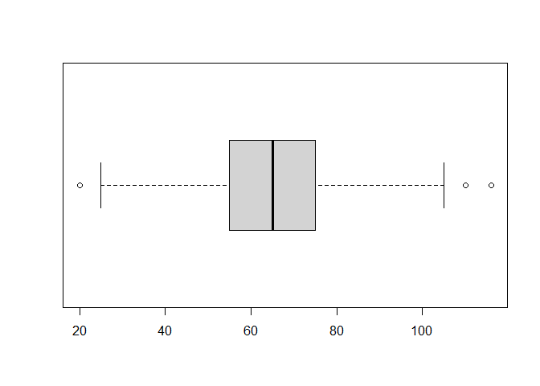

Untitled
================

``` r
library(datasets)
library(dplyr)
```

    ## 
    ## Attaching package: 'dplyr'

    ## The following objects are masked from 'package:stats':
    ## 
    ##     filter, lag

    ## The following objects are masked from 'package:base':
    ## 
    ##     intersect, setdiff, setequal, union

``` r
setwd("C:/Users/raley/OneDrive/Escritorio/mineria de datos tareas/actividades mineria/ACT3")
data <- read.csv("pokemon.csv")

head(data)
```

    ##   X.                  Name Type.1 Type.2 Total HP Attack Defense Sp..Atk
    ## 1  1             Bulbasaur  Grass Poison   318 45     49      49      65
    ## 2  2               Ivysaur  Grass Poison   405 60     62      63      80
    ## 3  3              Venusaur  Grass Poison   525 80     82      83     100
    ## 4  3 VenusaurMega Venusaur  Grass Poison   625 80    100     123     122
    ## 5  4            Charmander   Fire          309 39     52      43      60
    ## 6  5            Charmeleon   Fire          405 58     64      58      80
    ##   Sp..Def Speed Generation Legendary
    ## 1      65    45          1     False
    ## 2      80    60          1     False
    ## 3     100    80          1     False
    ## 4     120    80          1     False
    ## 5      50    65          1     False
    ## 6      65    80          1     False

``` r
datos <- filter(data, Legendary == "False")
datos <- select(datos, Name, Type.1, Type.2, HP, Attack)
```

``` r
datos <- filter(datos, Type.1 == "Psychic" | Type.2 == "Psychic")
```

``` r
attach(datos)
boxplot(HP, horizontal = TRUE)
```

<!-- -->

``` r
boxplot.stats(HP)
```

    ## $stats
    ## [1]  20  55  65  80 116
    ## 
    ## $n
    ## [1] 71
    ## 
    ## $conf
    ## [1] 60.31221 69.68779
    ## 
    ## $out
    ## [1] 190 120

``` r
boxplot(Attack, horizontal = TRUE)
```

<!-- -->

``` r
boxplot.stats(Attack)
```

    ## $stats
    ## [1]  20  40  55  75 125
    ## 
    ## $n
    ## [1] 71
    ## 
    ## $conf
    ## [1] 48.4371 61.5629
    ## 
    ## $out
    ## [1] 135 145 165

``` r
attach(datos)
```

    ## The following objects are masked from datos (pos = 3):
    ## 
    ##     Attack, HP, Name, Type.1, Type.2

``` r
datos <- filter(datos, HP < 120 & Attack < 135)
attach(datos)
```

    ## The following objects are masked from datos (pos = 3):
    ## 
    ##     Attack, HP, Name, Type.1, Type.2

    ## The following objects are masked from datos (pos = 4):
    ## 
    ##     Attack, HP, Name, Type.1, Type.2

``` r
boxplot(HP, horizontal = TRUE)
```

<!-- -->

``` r
boxplot.stats(HP)
```

    ## $stats
    ## [1]  25  55  65  75 105
    ## 
    ## $n
    ## [1] 66
    ## 
    ## $conf
    ## [1] 61.11031 68.88969
    ## 
    ## $out
    ## [1]  20 116 110

``` r
boxplot(Attack, horizontal = TRUE)
```

<!-- -->

``` r
boxplot.stats(Attack)
```

    ## $stats
    ## [1]  20  40  55  75 125
    ## 
    ## $n
    ## [1] 66
    ## 
    ## $conf
    ## [1] 48.19304 61.80696
    ## 
    ## $out
    ## integer(0)

``` r
attach(datos)
```

    ## The following objects are masked from datos (pos = 3):
    ## 
    ##     Attack, HP, Name, Type.1, Type.2

    ## The following objects are masked from datos (pos = 4):
    ## 
    ##     Attack, HP, Name, Type.1, Type.2

    ## The following objects are masked from datos (pos = 5):
    ## 
    ##     Attack, HP, Name, Type.1, Type.2

``` r
datos <- filter(datos, HP < 110)
attach(datos)
```

    ## The following objects are masked from datos (pos = 3):
    ## 
    ##     Attack, HP, Name, Type.1, Type.2

    ## The following objects are masked from datos (pos = 4):
    ## 
    ##     Attack, HP, Name, Type.1, Type.2

    ## The following objects are masked from datos (pos = 5):
    ## 
    ##     Attack, HP, Name, Type.1, Type.2

    ## The following objects are masked from datos (pos = 6):
    ## 
    ##     Attack, HP, Name, Type.1, Type.2

``` r
boxplot(HP, horizontal = TRUE)
```

<!-- -->

``` r
boxplot.stats(HP)
```

    ## $stats
    ## [1]  25.0  54.0  65.0  74.5 105.0
    ## 
    ## $n
    ## [1] 64
    ## 
    ## $conf
    ## [1] 60.95125 69.04875
    ## 
    ## $out
    ## [1] 20

``` r
boxplot(Attack, horizontal = TRUE)
```

<!-- -->

``` r
boxplot.stats(Attack)
```

    ## $stats
    ## [1]  20.0  40.0  54.5  75.0 125.0
    ## 
    ## $n
    ## [1] 64
    ## 
    ## $conf
    ## [1] 47.5875 61.4125
    ## 
    ## $out
    ## integer(0)

``` r
attach(datos)
```

    ## The following objects are masked from datos (pos = 3):
    ## 
    ##     Attack, HP, Name, Type.1, Type.2

    ## The following objects are masked from datos (pos = 4):
    ## 
    ##     Attack, HP, Name, Type.1, Type.2

    ## The following objects are masked from datos (pos = 5):
    ## 
    ##     Attack, HP, Name, Type.1, Type.2

    ## The following objects are masked from datos (pos = 6):
    ## 
    ##     Attack, HP, Name, Type.1, Type.2

    ## The following objects are masked from datos (pos = 7):
    ## 
    ##     Attack, HP, Name, Type.1, Type.2

``` r
datos <- filter(datos, HP > 20)
attach(datos)
```

    ## The following objects are masked from datos (pos = 3):
    ## 
    ##     Attack, HP, Name, Type.1, Type.2

    ## The following objects are masked from datos (pos = 4):
    ## 
    ##     Attack, HP, Name, Type.1, Type.2

    ## The following objects are masked from datos (pos = 5):
    ## 
    ##     Attack, HP, Name, Type.1, Type.2

    ## The following objects are masked from datos (pos = 6):
    ## 
    ##     Attack, HP, Name, Type.1, Type.2

    ## The following objects are masked from datos (pos = 7):
    ## 
    ##     Attack, HP, Name, Type.1, Type.2

    ## The following objects are masked from datos (pos = 8):
    ## 
    ##     Attack, HP, Name, Type.1, Type.2

``` r
boxplot(HP, horizontal = TRUE)
```

<!-- -->

``` r
boxplot.stats(HP)
```

    ## $stats
    ## [1]  28.0  55.0  65.0  74.5 100.0
    ## 
    ## $n
    ## [1] 63
    ## 
    ## $conf
    ## [1] 61.1183 68.8817
    ## 
    ## $out
    ## [1]  25 105

``` r
boxplot(Attack, horizontal = TRUE)
```

<!-- -->

``` r
boxplot.stats(Attack)
```

    ## $stats
    ## [1]  20  40  55  75 125
    ## 
    ## $n
    ## [1] 63
    ## 
    ## $conf
    ## [1] 48.03285 61.96715
    ## 
    ## $out
    ## integer(0)

``` r
attach(datos)
```

    ## The following objects are masked from datos (pos = 3):
    ## 
    ##     Attack, HP, Name, Type.1, Type.2

    ## The following objects are masked from datos (pos = 4):
    ## 
    ##     Attack, HP, Name, Type.1, Type.2

    ## The following objects are masked from datos (pos = 5):
    ## 
    ##     Attack, HP, Name, Type.1, Type.2

    ## The following objects are masked from datos (pos = 6):
    ## 
    ##     Attack, HP, Name, Type.1, Type.2

    ## The following objects are masked from datos (pos = 7):
    ## 
    ##     Attack, HP, Name, Type.1, Type.2

    ## The following objects are masked from datos (pos = 8):
    ## 
    ##     Attack, HP, Name, Type.1, Type.2

    ## The following objects are masked from datos (pos = 9):
    ## 
    ##     Attack, HP, Name, Type.1, Type.2

``` r
datos <- filter(datos, HP > 25)
attach(datos)
```

    ## The following objects are masked from datos (pos = 3):
    ## 
    ##     Attack, HP, Name, Type.1, Type.2

    ## The following objects are masked from datos (pos = 4):
    ## 
    ##     Attack, HP, Name, Type.1, Type.2

    ## The following objects are masked from datos (pos = 5):
    ## 
    ##     Attack, HP, Name, Type.1, Type.2

    ## The following objects are masked from datos (pos = 6):
    ## 
    ##     Attack, HP, Name, Type.1, Type.2

    ## The following objects are masked from datos (pos = 7):
    ## 
    ##     Attack, HP, Name, Type.1, Type.2

    ## The following objects are masked from datos (pos = 8):
    ## 
    ##     Attack, HP, Name, Type.1, Type.2

    ## The following objects are masked from datos (pos = 9):
    ## 
    ##     Attack, HP, Name, Type.1, Type.2

    ## The following objects are masked from datos (pos = 10):
    ## 
    ##     Attack, HP, Name, Type.1, Type.2

``` r
boxplot(HP, horizontal = TRUE)
```

<!-- -->

``` r
boxplot.stats(HP)
```

    ## $stats
    ## [1]  28  55  65  75 105
    ## 
    ## $n
    ## [1] 62
    ## 
    ## $conf
    ## [1] 60.9868 69.0132
    ## 
    ## $out
    ## integer(0)

``` r
boxplot(Attack, horizontal = TRUE)
```

<!-- -->

``` r
boxplot.stats(Attack)
```

    ## $stats
    ## [1]  23  40  55  75 125
    ## 
    ## $n
    ## [1] 62
    ## 
    ## $conf
    ## [1] 47.97689 62.02311
    ## 
    ## $out
    ## integer(0)
