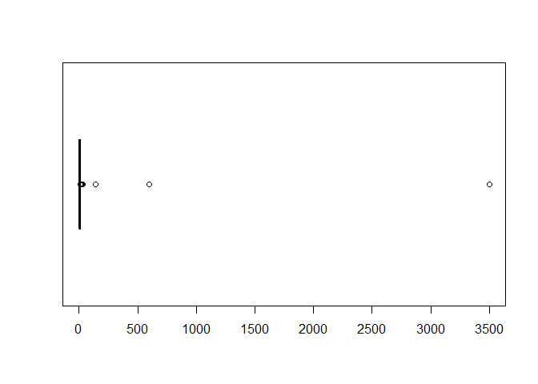
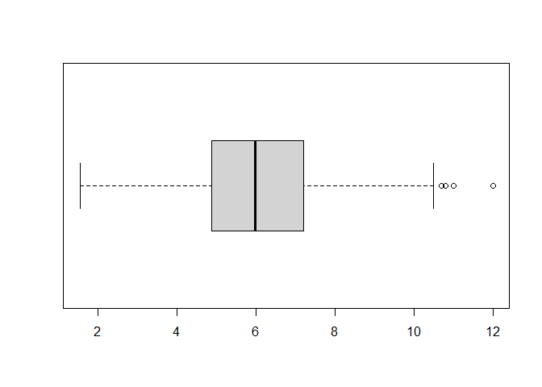
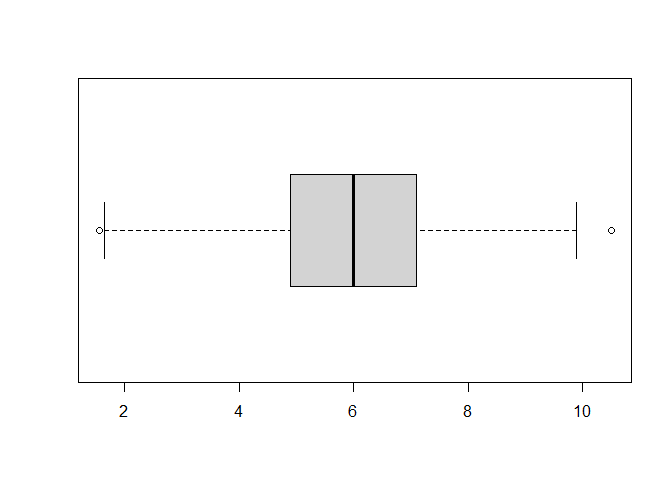
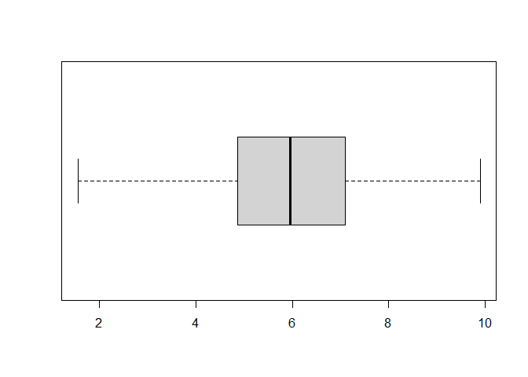
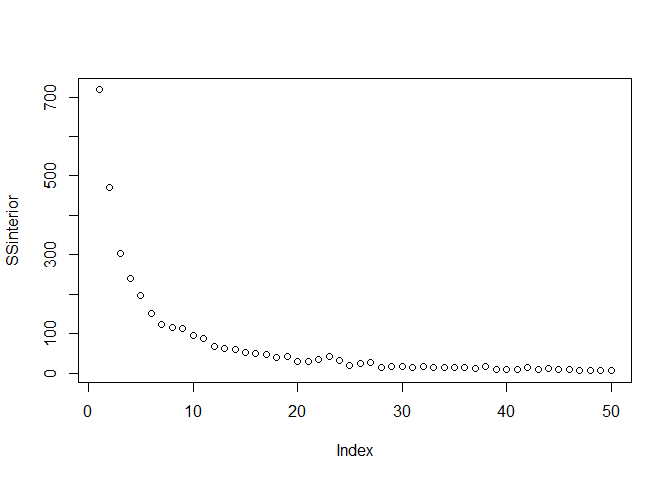
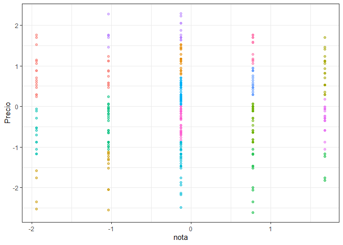
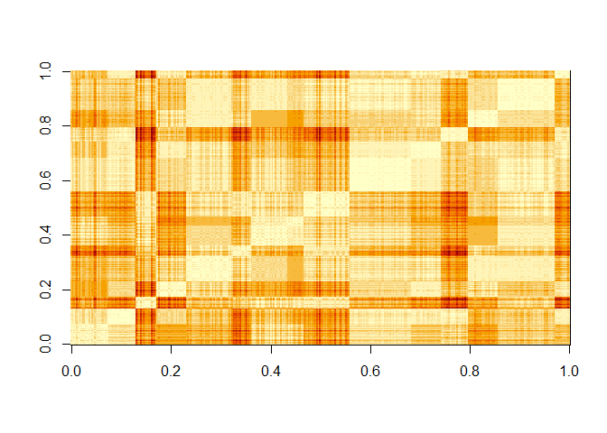
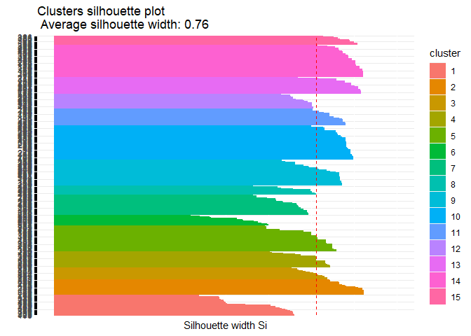
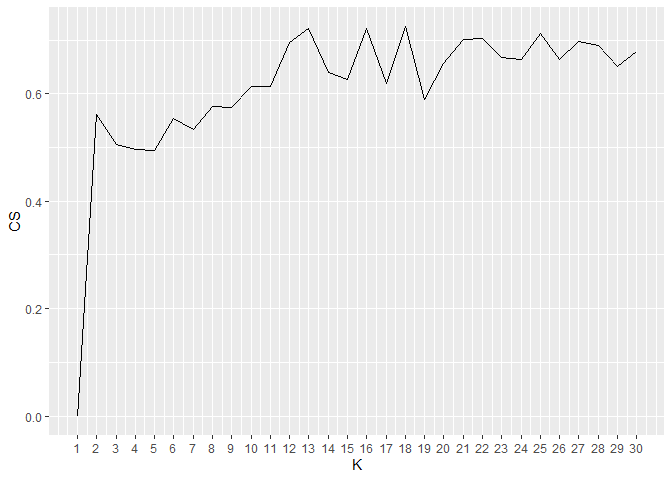
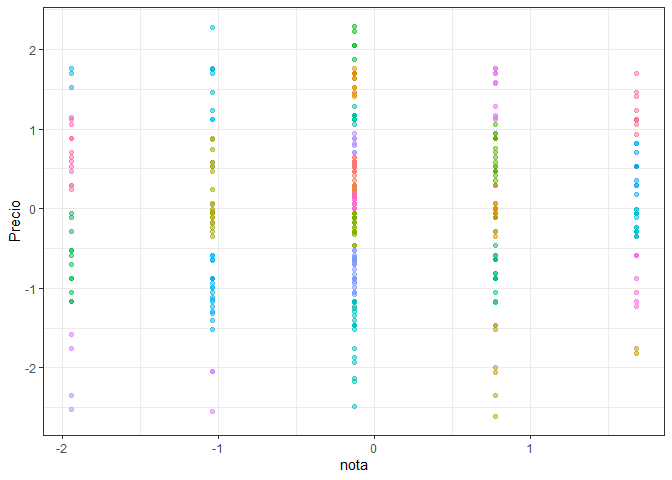

Untitled
================

``` r
library(tidyverse)
```

    ## -- Attaching packages --------------------------------------- tidyverse 1.3.0 --

    ## v ggplot2 3.3.3     v purrr   0.3.4
    ## v tibble  3.1.0     v dplyr   1.0.5
    ## v tidyr   1.1.3     v stringr 1.4.0
    ## v readr   1.4.0     v forcats 0.5.1

    ## -- Conflicts ------------------------------------------ tidyverse_conflicts() --
    ## x dplyr::filter() masks stats::filter()
    ## x dplyr::lag()    masks stats::lag()

``` r
library(readr)
library(datasets)
library(factoextra)
```

    ## Warning: package 'factoextra' was built under R version 4.0.5

    ## Welcome! Want to learn more? See two factoextra-related books at https://goo.gl/ve3WBa

``` r
library(flexclust)
```

    ## Warning: package 'flexclust' was built under R version 4.0.5

    ## Loading required package: grid

    ## Loading required package: lattice

    ## Loading required package: modeltools

    ## Loading required package: stats4

``` r
library(cluster)
```

``` r
setwd("C:/Users/raley/OneDrive/Escritorio/mineria de datos tareas/actividades mineria/ACT4")
data <- read.csv("sanguchez.csv", sep=";")

summary(data)
```

    ##      url               Local            Direccion            Precio         
    ##  Length:410         Length:410         Length:410         Length:410        
    ##  Class :character   Class :character   Class :character   Class :character  
    ##  Mode  :character   Mode  :character   Mode  :character   Mode  :character  
    ##                                                                             
    ##                                                                             
    ##                                                                             
    ##                                                                             
    ##  Ingredientes            nota          texto          
    ##  Length:410         Min.   :1.000   Length:410        
    ##  Class :character   1st Qu.:3.000   Class :character  
    ##  Mode  :character   Median :3.000   Mode  :character  
    ##                     Mean   :3.167                     
    ##                     3rd Qu.:4.000                     
    ##                     Max.   :5.000                     
    ##                     NA's   :8

``` r
datos <- select(data, nota,Precio)
datos <- na.omit(datos)
head(datos)
```

    ##   nota  Precio
    ## 1    3 $5.210.
    ## 2    3  $7.000
    ## 3    4  $7.290
    ## 4    4  $8.690
    ## 5    4  $4.900
    ## 6    3  $6.500

``` r
data_numerica <- datos
data_numerica$nota <- as.numeric(data_numerica$nota)
data_numerica$Precio <- parse_number(data_numerica$Precio)
data_numerica <- na.omit(data_numerica)
head(data_numerica)
```

    ##   nota Precio
    ## 1    3   5.21
    ## 2    3   7.00
    ## 3    4   7.29
    ## 4    4   8.69
    ## 5    4   4.90
    ## 6    3   6.50

``` r
boxplot(data_numerica$Precio, horizontal = TRUE)
```

<!-- -->

``` r
boxplot.stats(data_numerica$Precio)
```

    ## $stats
    ## [1]  1.55  4.95  6.25  7.80 12.00
    ## 
    ## $n
    ## [1] 400
    ## 
    ## $conf
    ## [1] 6.02485 6.47515
    ## 
    ## $out
    ##  [1]   17.0   15.0   18.0   12.9   14.5   22.0   18.0   18.0 3500.0   15.5
    ## [11]   23.0   15.0   28.0   19.0   20.0  600.0   14.6   14.9   15.0   14.0
    ## [21]   16.9   16.0   12.9   16.0   13.5   26.0  140.0   13.0   14.0   25.0
    ## [31]   17.0   22.0   14.0   18.0

``` r
data_numerica <- filter(data_numerica, Precio < 12.9)
boxplot(data_numerica$Precio, horizontal = TRUE)
```

<!-- -->

``` r
boxplot.stats(data_numerica$Precio)
```

    ## $stats
    ## [1]  1.55  4.89  5.99  7.20 10.50
    ## 
    ## $n
    ## [1] 366
    ## 
    ## $conf
    ## [1] 5.799222 6.180778
    ## 
    ## $out
    ## [1] 12.0 12.0 11.0 10.7 10.8

``` r
data_numerica <- filter(data_numerica, Precio < 10.7)
boxplot(data_numerica$Precio, horizontal = TRUE)
```

<!-- -->

``` r
boxplot.stats(data_numerica$Precio)
```

    ## $stats
    ## [1] 1.65 4.89 5.99 7.10 9.90
    ## 
    ## $n
    ## [1] 361
    ## 
    ## $conf
    ## [1] 5.806221 6.173779
    ## 
    ## $out
    ## [1] 10.50  1.55

``` r
data_numerica <- filter(data_numerica, Precio < 10.5)
boxplot(data_numerica$Precio, horizontal = TRUE)
```

<!-- -->

``` r
boxplot.stats(data_numerica$Precio)
```

    ## $stats
    ## [1] 1.55 4.87 5.96 7.10 9.90
    ## 
    ## $n
    ## [1] 360
    ## 
    ## $conf
    ## [1] 5.774301 6.145699
    ## 
    ## $out
    ## numeric(0)

``` r
data_escalada <- scale(data_numerica) %>% as_tibble()
data_escalada %>% summary()
```

    ##       nota             Precio        
    ##  Min.   :-1.9404   Min.   :-2.60410  
    ##  1st Qu.:-0.1307   1st Qu.:-0.65444  
    ##  Median :-0.1307   Median :-0.02212  
    ##  Mean   : 0.0000   Mean   : 0.00000  
    ##  3rd Qu.: 0.7741   3rd Qu.: 0.64533  
    ##  Max.   : 1.6790   Max.   : 2.28468

``` r
SSinterior <- numeric(50)
for(k in 1:50){
  modelo <- kmeans(data_escalada, centers = k)
  SSinterior[k] <- modelo$tot.withinss
}
plot(SSinterior)
```

<!-- -->

``` r
data_kmeans <- kmeans(data_escalada, centers = 15)

data_escalada$clus <- data_kmeans$cluster %>% as.factor()

ggplot(data_escalada, aes(nota, Precio, color=clus)) + geom_point(alpha=0.5, show.legend = F) + theme_bw()
```

<!-- -->

``` r
tempDist <- dist(data_numerica) %>% as.matrix()

index <- sort(data_kmeans$cluster, index.return=TRUE)
tempDist <- tempDist[index$ix,index$ix]
rownames(tempDist) <- c(1:nrow(data_numerica))
colnames(tempDist) <- c(1:nrow(data_numerica))

image(tempDist)
```

<!-- -->

``` r
res <- get_clust_tendency(data_numerica, n=30, graph = FALSE)

tempMatrix <- matrix(0, nrow = nrow(data_escalada), ncol = nrow(data_escalada))
tempMatrix[which(index$x==1), which(index$x==1)]  <- 1
tempMatrix[which(index$x==2), which(index$x==2)]  <- 1
tempMatrix[which(index$x==3), which(index$x==3)]  <- 1
tempMatrix[which(index$x==4), which(index$x==4)]  <- 1
tempMatrix[which(index$x==5), which(index$x==5)]  <- 1
tempMatrix[which(index$x==6), which(index$x==6)]  <- 1
tempMatrix[which(index$x==7), which(index$x==7)]  <- 1
tempMatrix[which(index$x==8), which(index$x==8)]  <- 1
tempMatrix[which(index$x==9), which(index$x==9)]  <- 1
tempMatrix[which(index$x==10), which(index$x==10)] <- 1
tempMatrix[which(index$x==11), which(index$x==11)] <- 1
tempMatrix[which(index$x==12), which(index$x==12)] <- 1
tempMatrix[which(index$x==13), which(index$x==13)] <- 1
tempMatrix[which(index$x==14), which(index$x==14)] <- 1
tempMatrix[which(index$x==15), which(index$x==15)] <- 1

tempDist2 <- 1/(1+tempDist)
cor <- cor(tempMatrix[upper.tri(tempMatrix)],tempDist2[upper.tri(tempDist2)])

print(res)
```

    ## $hopkins_stat
    ## [1] 0.7966429
    ## 
    ## $plot
    ## NULL

``` r
print(cor)
```

    ## [1] 0.6304493

``` r
data_escalada <- apply(data_escalada,2,as.numeric)
 
#Cohesion
withinCluster <- numeric(15)
for (i in 1:15){
  tempData <- data_escalada[which(data_kmeans$cluster == i),]
  withinCluster[i] <- sum(dist2(tempData,colMeans(tempData))^2)
}
cohesion = sum(withinCluster)

print(c(cohesion, data_kmeans$tot.withinss))
```

    ## [1] 52.45058 52.45058

``` r
meanData <- colMeans(data_escalada)
SSB <- numeric(15)
for (i in 1:15){
  tempData <- data_escalada[which(data_kmeans$cluster==i),]
  SSB[i] <- nrow(tempData)*sum((meanData-colMeans(tempData))^2)
}
separation = sum(SSB)

print(separation)
```

    ## [1] 7058.924

``` r
coefSil <- silhouette(data_kmeans$cluster,dist(data_escalada))
summary(coefSil)
```

    ## Silhouette of 360 units in 15 clusters from silhouette.default(x = data_kmeans$cluster, dist = dist(data_escalada)) :
    ##  Cluster sizes and average silhouette widths:
    ##        27        20        15        21        33        14        26        12 
    ## 0.5711635 0.8588308 0.7461678 0.7463036 0.7485803 0.5227341 0.6787034 0.6909632 
    ##        33        44        22        19        22        41        11 
    ## 0.7792257 0.8382686 0.8100000 0.7180482 0.8464097 0.8637813 0.8495540 
    ## Individual silhouette widths:
    ##    Min. 1st Qu.  Median    Mean 3rd Qu.    Max. 
    ##  0.3554  0.7064  0.7916  0.7635  0.8475  0.9016

``` r
fviz_silhouette(coefSil) + coord_flip()
```

    ##    cluster size ave.sil.width
    ## 1        1   27          0.57
    ## 2        2   20          0.86
    ## 3        3   15          0.75
    ## 4        4   21          0.75
    ## 5        5   33          0.75
    ## 6        6   14          0.52
    ## 7        7   26          0.68
    ## 8        8   12          0.69
    ## 9        9   33          0.78
    ## 10      10   44          0.84
    ## 11      11   22          0.81
    ## 12      12   19          0.72
    ## 13      13   22          0.85
    ## 14      14   41          0.86
    ## 15      15   11          0.85

<!-- -->

``` r
coefSil=numeric(30)
for (k in 2:30){
  modelo <- kmeans(data_escalada, centers = k)
  temp <- silhouette(modelo$cluster,dist(data_escalada))
  coefSil[k] <- mean(temp[,3])
}
tempDF=data.frame(CS=coefSil,K=c(1:30))

ggplot(tempDF, aes(x=K, y=CS)) + 
  geom_line() +
  scale_x_continuous(breaks=c(1:30))
```

<!-- -->

``` r
data_final <- scale(data_numerica) %>% as_tibble()
data_final %>% summary()
```

    ##       nota             Precio        
    ##  Min.   :-1.9404   Min.   :-2.60410  
    ##  1st Qu.:-0.1307   1st Qu.:-0.65444  
    ##  Median :-0.1307   Median :-0.02212  
    ##  Mean   : 0.0000   Mean   : 0.00000  
    ##  3rd Qu.: 0.7741   3rd Qu.: 0.64533  
    ##  Max.   : 1.6790   Max.   : 2.28468

``` r
data_kmeans2 <- kmeans(data_final, centers = 25)

data_final$clus <- data_kmeans2$cluster %>% as.factor()

ggplot(data_final, aes(nota, Precio, color=clus)) + geom_point(alpha=0.5, show.legend = F) + theme_bw()
```

<!-- -->
